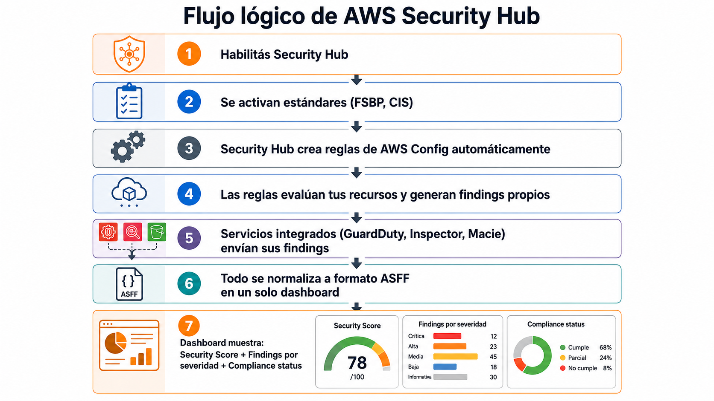

# Evaluar postura CSPM y centralizar hallazgos


| Campo | Definición |
|-------|------------|
| **Servicio principal** | AWS Security Hub |
| **Prioridad** | Alta |
| **Objetivo** | Automatizar controles de buenas prácticas y centralizar findings de seguridad |
| **Riesgo mitigado** | Configuraciones inseguras no detectadas, hallazgos dispersos o falta de score de postura |

## ¿Que es y para que sirve?

AWS Security Hub es un servicio de **CSPM (Cloud security posture Management)** que hace dos cosas:

1. **Agregar findings**: Recolecta alertas de seguridad de GuardDuty, Inspector, Macie,
    IAM Access, AWS config y herramientas de terceros en un solo dashboard.
    Todo se normaliza al formato **ASFF (AWS Security Finding Format)**.

2. **Evalua copliance**: Ejecuta checks automaticos contra estandares como:
     CIS AWS Foundations, **AWS Foundational Security Best Practices     (FSBP)** , **Payment card security industry data Security Standard (PCI DSS)** y **NIST SP 800-52 (Guidelines for the Selection, Configuration, and Use of TLS Implementations)**.
    Te da un **Security Score** que mide que tan bien estas.

### Analogia

Pensalo como el **Centro de operaciones de un aeropuerto**:

- GuardDuty es el equipo que vigila las camaras del perimetro (amenazas)
- Inspector es el equipo de escaneo de equipaje (vulnerabilidades)
- Macie es el control de pasaportes (datos sensibles)
- Config es el equipo de mantenimiento que verifica que todo cumpla normas

**Security Hub es la sala con todos los monitores**, donde un coordinador ve todas las alertas juntas, las prioriza por severidad y mide si se estan cumpliendo los procedimientos de seguridad. No reemplaza a ningun equipo, pero se asegura de que nada se pieda.

> **En resumen:** sin security hub tenes hallazgos dispersos en +5 consolas distintas.
> con Security Hub, tenes un solo lugar con un score que te dice donde estas parado.

---

### Flujo basico




### Estándares disponibles

| Estándar | ARN (us-east-1) | Uso recomendado |
|----------|-----------------|-----------------|
| **AWS Foundational Security Best Practices (FSBP)** | `arn:aws:securityhub:us-east-1::standards/aws-foundational-security-best-practices/v/1.0.0` | ✅ Siempre habilitar |
| **CIS AWS Foundations v1.4.0** | `arn:aws:securityhub:us-east-1::standards/cis-aws-foundations-benchmark/v/1.4.0` | ✅ Recomendado |
| **CIS AWS Foundations v3.0.0** | `arn:aws:securityhub:us-east-1::standards/cis-aws-foundations-benchmark/v/3.0.0` | ✅ Si aplica la versión más reciente |
| **NIST SP 800-53 Rev. 5** | `arn:aws:securityhub:us-east-1::standards/nist-800-53/v/5.0.0` | Si requiere cumplimiento NIST |
| **PCI DSS v4.0.1** | `arn:aws:securityhub:us-east-1::standards/pci-dss/v/4.0.1` | Solo si procesás datos de tarjetas |


### Buenas prácticas (de mi documentación)
- Habilitar AWS Security Hub en cuentas relevantes
- Activar **AWS Foundational Security Best Practices** como mínimo
- Evaluar CIS AWS Foundations y PCI DSS si aplica
- Integrar GuardDuty, Inspector, Macie, IAM Access Analyzer y AWS Config
- Definir **owners, SLAs y KPI** de remediación

### Validación mínima
- [ ] Security Hub habilitado centralmente
- [ ] Estándares base activos (FSBP + CIS como mínimo)
- [ ] Findings revisados periódicamente
- [ ] Score informado como KPI

---

## Relacion con otros servicios

### Tabla de relaciones

| Se relaciona con | Tipo | ¿Cómo? |
|---|---|---|
| **GuardDuty** | Integración directa | Envía findings de amenazas (credenciales comprometidas, malware, actividad sospechosa) a Security Hub |
| **Amazon Inspector** | Integración directa | Envía findings de vulnerabilidades en EC2, ECR y Lambda |
| **Amazon Macie** | Integración directa | Envía findings de datos sensibles mal ubicados o expuestos en S3 |
| **IAM Access Analyzer** | Integración directa | Envía findings de accesos externos no intencionales (roles, buckets, KMS, etc. compartidos externamente) |
| **AWS Config** | Dependencia directa | Security Hub usa reglas de Config por detrás para evaluar los controles de compliance. **Config debe estar habilitado** para que funcionen los estándares |
| **CloudTrail** | Indirecto | Registra las acciones sobre Security Hub (quién habilitó/deshabilitó, quién cambió findings) |
| **EventBridge** | Automatización | Podés crear reglas en EventBridge que reaccionen a findings de Security Hub (ej: finding CRITICAL → dispara Lambda) |
| **SNS** | Notificaciones | Enviar alerts por email/Slack cuando aparecen findings de alta severidad |
| **Lambda** | Remediación | Funciones Lambda que remedian automáticamente findings (ej: cerrar un SG abierto) |
| **AWS Organizations** | Multi-cuenta | Permite habilitar Security Hub centralizado con un administrador delegado para todas las cuentas |
| **CloudWatch** | Métricas | Security Hub publica métricas en CloudWatch para monitoreo y alarmas |
| **Firewall Manager** | Integración directa | Envía findings de políticas de firewall no cumplidas |
| **Systems Manager** | Remediación | SSM Automation documents pueden remediar findings automáticamente |

### Diagrama de integracion

```
┌─────────────────────────────────────────────────────────────────┐
│                    FUENTES DE FINDINGS                          │
│                                                                 │
│  ┌───────────┐ ┌───────────┐ ┌───────────┐ ┌────────────────┐  │
│  │ GuardDuty │ │ Inspector │ │  Macie    │ │ IAM Access     │  │
│  │ (amenazas)│ │ (vulns)   │ │ (datos)   │ │ Analyzer       │  │
│  └─────┬─────┘ └─────┬─────┘ └─────┬─────┘ │ (accesos ext.) │  │
│        │              │              │       └───────┬────────┘  │
│  ┌─────┴──────┐       │              │               │           │
│  │ AWS Config │       │              │               │           │
│  │ (compliance│       │              │               │           │
│  │  rules)    │       │              │               │           │
│  └─────┬──────┘       │              │               │           │
└────────┼──────────────┼──────────────┼───────────────┼───────────┘
         │              │              │               │
         ▼              ▼              ▼               ▼
┌─────────────────────────────────────────────────────────────────┐
│                                                                 │
│                    🔍 AWS SECURITY HUB                          │
│                                                                 │
│  ┌─────────────────────────────────────────────────────────┐    │
│  │  Formato normalizado: ASFF                              │    │
│  │  (AWS Security Finding Format)                          │    │
│  └─────────────────────────────────────────────────────────┘    │
│                                                                 │
│  ┌──────────────┐  ┌──────────────┐  ┌──────────────────────┐  │
│  │ Security     │  │ Estándares   │  │ Findings agregados   │  │
│  │ Score: 78%   │  │ FSBP ✅      │  │ CRITICAL: 3          │  │
│  │              │  │ CIS  ✅      │  │ HIGH: 12             │  │
│  │              │  │ PCI  ❌      │  │ MEDIUM: 45           │  │
│  └──────────────┘  └──────────────┘  └──────────────────────┘  │
│                                                                 │
└──────────────┬──────────────────────────────┬───────────────────┘
               │                              │
               ▼                              ▼
┌──────────────────────────┐    ┌──────────────────────────────┐
│     RESPUESTA MANUAL     │    │     RESPUESTA AUTOMATIZADA   │
│                          │    │                              │
│  • Dashboard review      │    │  EventBridge → Lambda        │
│  • Asignar owners        │    │  EventBridge → SNS → Slack   │
│  • Tickets en Jira       │    │  EventBridge → SSM Automation│
│  • Remediación manual    │    │  → Remediación automática    │
└──────────────────────────┘    └──────────────────────────────┘
```

### Nota sobre AWS Config

> **Importante**: Security Hub **depende de AWS Config** para funcionar.
> Cuando habilitas un estandar (Ej; FSBP), Security Hub crea las reglas de config
> no van a funcionar y vas a ver findings con estado `NOT_AVAILABLE`
> Asegurate de tener **AWS Config habilitado** antes de habilitar Security Hub

---

## Consola

> Ver capturas en [`consola/creenshots.md`](./consola/screenshots.md)

**Ruta para habilitar:**

1. AWS Console -> buscar **Security Hub**
2. Click en **Go to Security Hub**
3. Seleccionar estandares a habilitar (FSBP Y CIS recomendados)
4. Click en **Enable Security Hub**

**Dashboard principal:**

- **Summary**: Security score general + findings por severidad
- **Security standards**: Score por estandar habilitado
- **Findings**: Lista filtrable por severidad, estandar, servicio, cuenta
- **Integrations**: Ver que servicios estan enviando findings

**Filtros utiles en Findings:**

- Severity: `CRITICAL` y `HIGH` 
- Workflow status: `NEW` (sin revisar)
- Record state: `ACTIVE`

---

## CLI + Terraform

> Ver archivos completos en [`cli-terraform/`](./cli-terraform/)

### CLI - Habilitar Security Hub con estándares por defecto
```bash
aws securityhub enable-security-hub \
  --enable-default-standards
```

### CLI - Habilitar sin estándares por defecto (agregarlos manualmente después)
```bash
aws securityhub enable-security-hub \
  --no-enable-default-standards
```

### CLI - Verificar estado de Security Hub
```bash
aws securityhub describe-hub
```

### CLI - Ver estándares habilitados
```bash
aws securityhub get-enabled-standards
```

### CLI - Habilitar un estándar específico (CIS v1.4.0)
```bash
aws securityhub batch-enable-standards \
  --standards-subscription-requests \
    '[{"StandardsArn": "arn:aws:securityhub:us-east-1::standards/cis-aws-foundations-benchmark/v/1.4.0"}]'
```

### CLI - Ver findings CRITICAL y HIGH
```bash
aws securityhub get-findings \
  --filters '{
    "SeverityLabel": [{"Value": "CRITICAL", "Comparison": "EQUALS"}],
    "WorkflowStatus": [{"Value": "NEW", "Comparison": "EQUALS"}],
    "RecordState": [{"Value": "ACTIVE", "Comparison": "EQUALS"}]
  }' \
  --max-items 10
```

### CLI - Contar findings por severidad
```bash
aws securityhub get-findings \
  --filters '{"SeverityLabel": [{"Value": "HIGH", "Comparison": "EQUALS"}], "RecordState": [{"Value": "ACTIVE", "Comparison": "EQUALS"}]}' \
  --query 'Findings | length(@)'
```

### Terraform
```hcl
# Habilitar Security Hub
resource "aws_securityhub_account" "main" {
  enable_default_standards  = false
  auto_enable_controls      = true
  control_finding_generator = "SECURITY_CONTROL"
}

# Habilitar FSBP
resource "aws_securityhub_standards_subscription" "fsbp" {
  depends_on    = [aws_securityhub_account.main]
  standards_arn = "arn:aws:securityhub:us-east-1::standards/aws-foundational-security-best-practices/v/1.0.0"
}

# Habilitar CIS v1.4.0
resource "aws_securityhub_standards_subscription" "cis" {
  depends_on    = [aws_securityhub_account.main]
  standards_arn = "arn:aws:securityhub:us-east-1::standards/cis-aws-foundations-benchmark/v/1.4.0"
}

# Integrar GuardDuty
resource "aws_securityhub_product_subscription" "guardduty" {
  depends_on  = [aws_securityhub_account.main]
  product_arn = "arn:aws:securityhub:us-east-1::product/aws/guardduty"
}
```

---

## Referencias
- [AWS - Security Hub Documentation](https://aws.amazon.com/documentation-overview/security-hub/)
- [AWS - Security Hub Best Practices](https://aws.github.io/aws-security-services-best-practices/guides/security-hub/)
- [Terraform - aws_securityhub_account](https://registry.terraform.io/providers/hashicorp/aws/latest/docs/resources/securityhub_account)
- [Terraform - aws_securityhub_standards_subscription](https://registry.terraform.io/providers/hashicorp/aws/latest/docs/resources/securityhub_standards_subscription)
- [AWS CLI - enable-security-hub](https://docs.aws.amazon.com/cli/latest/reference/securityhub/enable-security-hub.html)
- [How to Enable Security Hub](https://oneuptime.com/blog/post/2026-02-12-enable-aws-security-hub/view)

