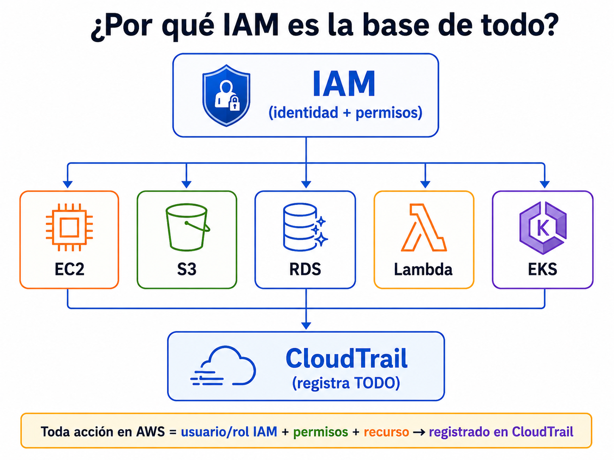

# Gestion de Identidades y Accesos

# Descripcion

Este es el **dominio mas importante** de todos los QuickWins.
IAM (Identity and Access Management) es la base de absolutamente todo en AWS. Cada accion que se ejecuta por IAM: quien sos, que podes hacer y sobre que recursos.

Si IAM esta mal configurado, nada de lo demas importa

Se trabajan **4 QuickWins**:

| # | QuickWin | Servicio principal | Prioridad |
|---|----------|-------------------|-----------| 
| 4 | [Autenticación Multi-Factor (MFA)](./mfa.md) | IAM / IAM Identity Center / Cognito | Alta |
| 5 | [Protección de la cuenta Root](./proteccion-root.md) | IAM / Organizations / SCP | Alta |
| 6 | [Federación de Identidades](./federacion-identidades.md) | IAM Identity Center / STS | Alta |
| 7 | [Limpieza de accesos no intencionales](./limpieza-accesos.md) | IAM Access Analyzer | Alta |

## Relación con otros dominios

| Dominio | Relación con IAM |
|---------|-----------------|
| 01 - Gobierno | Los contactos de seguridad necesitan permisos IAM para ser modificados |
| 02 - Aseguramiento | Security Hub evalúa controles de IAM (MFA, password policy, root keys) |
| 04 - Detección | CloudTrail registra todas las acciones IAM; GuardDuty detecta credenciales comprometidas |
| 06 - Infraestructura | Security Groups protegen EC2, pero IAM decide quién puede modificar esos SGs |
| 07 - Datos | IAM controla quién accede a S3, RDS, etc.; Access Analyzer detecta accesos externos |
| 08 - Aplicaciones | WAF protege apps web, pero IAM decide quién configura las reglas |