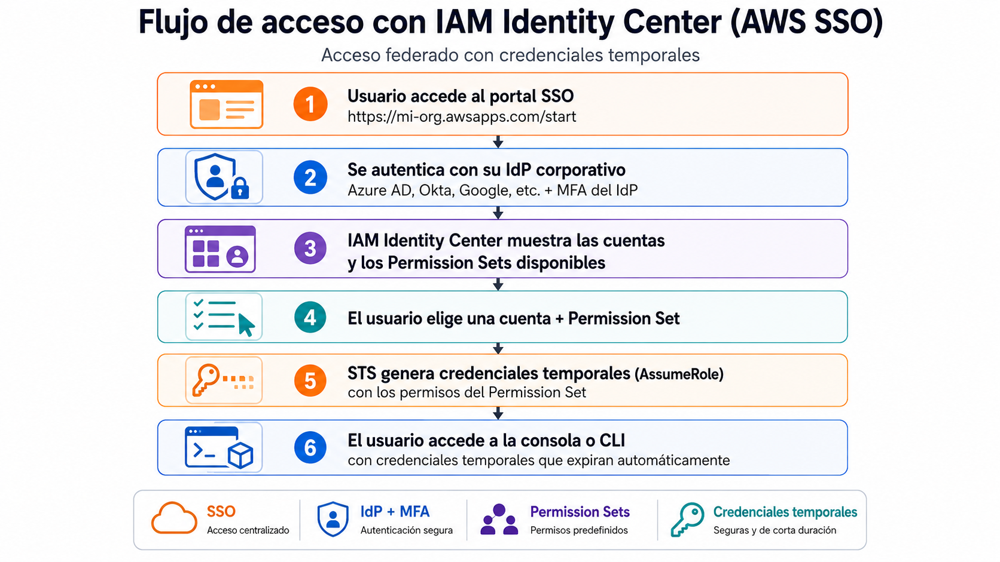

# Federacion de identidades 

| Campo | Definición |
|-------|------------|
| **Servicio principal** | IAM Identity Center (SSO) / STS / IAM Roles |
| **Prioridad** | Alta |
| **Objetivo** | Eliminar usuarios IAM con credenciales estáticas y usar identidades federadas con acceso temporal |
| **Riesgo mitigado** | Credenciales duraderas (access keys) que pueden ser robadas, filtradas o no rotadas |

---

## ¿Que es y para que sirve?

En vez de crear **Usuarios IAM** con usuaruio/contraseña y acces keys (credenciales temporales), la federacion permite que tus usuarios se autentiquen con un **proveedor de identidad externo** (Azure AD, Okta, Google workspace, etc) y reciban **credenciales temporales** para acceder a AWS

### Analogia

**Sin federacion** -> les da a cada persona una copia de la llave de la oficina. Si alguien la pierde, tenes que cambiar la cerradura para todos.

**Con federacion** -> Usas una cerradura inteligente. Cada persona se identifica con su huella digital y recibe un codigo temporal que dura unas horas. Si alguien se va de la empresa, simplemente lo deshabilitas del sistema central.

### ¿Por qué credenciales temporales > permanentes?

| Aspecto | IAM Users (permanentes) | Federación (temporales) |
|---------|------------------------|------------------------|
| **Duración** | Access keys no expiran | Credenciales duran 1-12 horas |
| **Rotación** | Manual, nadie la hace | Automática en cada sesión |
| **Offboarding** | Hay que acordarse de borrar el user | Se deshabilita en el IdP y listo |
| **MFA** | Configurar en cada usuario IAM | Se delega al IdP (un solo lugar) |
| **Auditoría** | Difícil saber quién es quién | Identidad individual trazable |
| **Escalabilidad** | Crear/borrar users manualmente | El IdP gestiona todo |

> **En resumen:** no crees IAM users a menos que sea estrictamente necesario.
> Usá federación.

---

## ¿Como funciona?

### Conceptos clave

| Concepto | Qué es |
|----------|--------|
| **Identity Center** | Servicio que gestiona SSO para múltiples cuentas AWS |
| **Permission Set** | Conjunto de permisos (como un IAM Role template) que se asigna a usuarios/grupos para una o más cuentas |
| **Identity Source** | De dónde vienen los usuarios: directorio interno de Identity Center, Active Directory o IdP externo (SAML) |
| **SSO Portal** | URL donde los usuarios inician sesión y ven sus cuentas/roles disponibles |
| **STS** | Security Token Service - genera las credenciales temporales detrás de escena |

### Buenas prácticas
- Priorizar **IAM Identity Center** sobre IAM users
- Usar **roles temporales** en vez de access keys
- Exigir MFA desde el proveedor de identidad
- Crear **Permission Sets** basados en least privilege
- Agrupar usuarios por función (admin, dev, readonly)

> **Nota**: IAM Identity Center requiere **AWS Organizations**. Si estás trabajando
> con una cuenta standalone, podés usar SAML federation directa con IAM Roles, pero
> Identity Center es la opción recomendada para organizaciones.

---