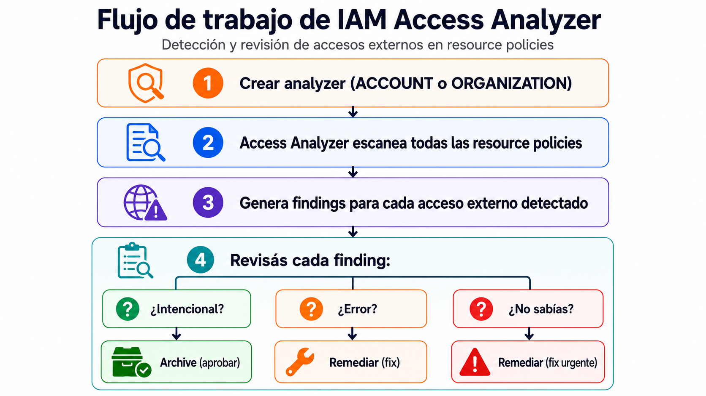
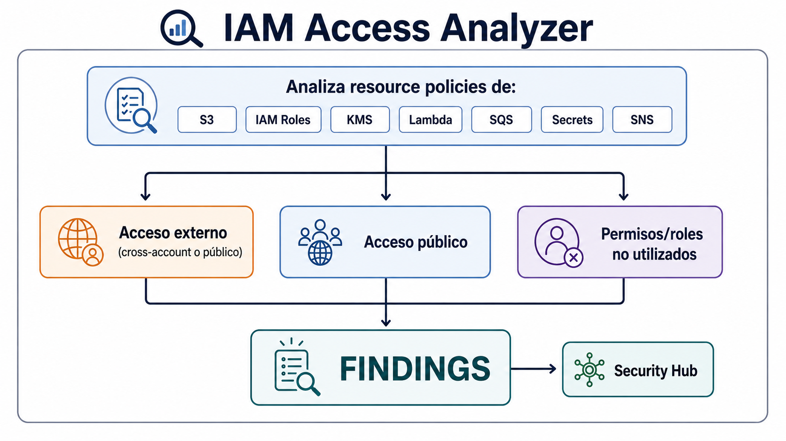

# Limpiar accesos externos y permisos no utilizados

| Campo | Definición |
|-------|------------|
| **Servicio principal** | IAM Access Analyzer |
| **Prioridad** | Alta |
| **Objetivo** | Detectar recursos compartidos externamente y reducir permisos o credenciales sin uso |
| **Riesgo mitigado** | Accesos no intencionales, roles asumibles externamente y credenciales duraderas olvidadas |

---

## ¿Que es y para que sirve?

IAM Acces Analyzer es un servicio que **analiza automaticamente** las politicas de tus recursos AWS para detectar dos cosas:

1. **Accesos externos**: ¿Hay algun bucket S3, Rol IAM, key KMS, funcion Lamba, cola SQS o secreto que este compartido con una cuenta externa o el publico?

2. **Accesos no utilizados**: ¿Hay roles, usuarios, acces keys o permisos que nadie usa?

### Analogia

Es como contratar un **auditor de seguridad** que revisa todo el edificio:

- ¿Hay alguna purta abierta que no deberia estarlo? (acceso externo)
_ ¿Hay llaves que nadie usa hace meses? (permisos sin uso)
- ¿Hay ventanas que quedaron abiertas por accidente? (recursos publicos)

El auditor te genera un reporte con cada hallazgo, y vos decidis si es intencional (lo marcas como aprobado) o si hay que corregirlo

> **En resumen** Access Analyzer encuentra lo que vos no sabias que estaba expuesto

---

## ¿Como funciona?

### Tipos de analyzer


| Tipo | Alcance | Qué detecta |
|------|---------|-------------|
| **ACCOUNT** | Una sola cuenta | Recursos compartidos fuera de tu cuenta |
| **ORGANIZATION** | Toda la organización | Recursos compartidos fuera de tu organización |
| **ACCOUNT_UNUSED_ACCESS** | Una sola cuenta | Roles, users, keys y permisos sin uso |
| **ORGANIZATION_UNUSED_ACCESS** | Toda la organización | Idem pero a nivel org |

### Recursos que analiza (acceso externo)

| Recurso | Qué verifica |
|---------|-------------|
| **S3 Buckets** | Bucket policies que permiten acceso público o a cuentas externas |
| **IAM Roles** | Trust policies que permiten AssumeRole desde entidades externas |
| **KMS Keys** | Key policies que permiten uso desde cuentas externas |
| **Lambda Functions** | Resource policies que permiten invocación externa |
| **SQS Queues** | Queue policies que permiten envío/recepción desde fuera |
| **Secrets Manager** | Resource policies que permiten lectura de secretos desde fuera |
| **SNS Topics** | Políticas que permiten publicación desde cuentas externas |
| **EFS** | Políticas de acceso desde fuera |


### Flujo de trabajo



### Buenas practicas 

- Crear analyzer a nivel organizacion o cuentas criticas
- Revisar roles, KMS Keys, Secrets, Lamba, S3 y SQS con acceso externo
- Identificar usuarios IAM, access keys y permisos sin uso
- Documentar excepciones legitimas con owner y fecha de revision

## Relacion con otros servicios

| Se relaciona con | Tipo | ¿Cómo? |
|---|---|---|
| **IAM** | Directo | Analiza IAM Roles (trust policies) y detecta roles no utilizados, permisos no usados, access keys sin uso |
| **S3** | Directo | Analiza bucket policies para detectar acceso público o cross-account |
| **KMS** | Directo | Analiza key policies para detectar acceso externo a claves de cifrado |
| **Lambda** | Directo | Analiza resource policies de funciones Lambda |
| **SQS** | Directo | Analiza queue policies de colas SQS |
| **Secrets Manager** | Directo | Analiza secret policies |
| **SNS** | Directo | Analiza topic policies |
| **Organizations** | Directo | Analyzer tipo ORGANIZATION analiza todas las cuentas miembro |
| **Security Hub** | Integración | Envía findings a Security Hub para visibilidad centralizada |
| **CloudTrail** | Indirecto | Usa datos de CloudTrail para determinar qué permisos se usaron (unused access analysis) |
| **AWS Config** | Indirecto | Config Rules pueden complementar Access Analyzer verificando configuraciones |


### Diagrama



## Consola

> Ver capturas en [`consola/screenshots.md`](./consola/screenshots.md)

### Acceder a Access Analyzer

1. AWS console --> buscar **IAM Acces Analyzer**
2. Tambien otra opcion IAM -> **Access Analyzer** (panel izquierdo)

### Crear External Access Analyzer

1. Acces Analyzer -> **Analyzers** -> **Crear analyzer**
2. Tipo **External acces analyzer**
3. Alcance: Account o Organization
4. Nombre: ej `mi-external-analyzer`

### Crear Unused Access Analyzer

1. Accces Analyzer -> **Create analyzer**
2. Tipo: **Unused acces analyzer**
3. Tracking period: 90 dias (estandar)

### Revisar findings

1. Acces Analyzer -> **Findings**
2. Filtrar por: Active, Resource Type, External principal
3. Click en un finding para ver detalle y decidir: Archive o Remediar

---

## CLI + Terraform 

> Ver archivos completos en [`cli-terraform/`](./cli-terraform/)

### CLI - Crear analyzer (tipo ACCOUNT)

```bash
aws accessanalyzer create-analyzer \
    --analyzer-name mi-account \
    --type ACCOUNT
```

### CLI - Crear analyzer (tipo ORGANIZATION)

```bash
aws accesanalyzer create-analyzer \
    --analyzer-name mi-org-analyzer \
    --type ORGANIZATION
```

### CLI - Listar analyzers

```bash
aws accessanalyzer list-analyzers \
  --query 'analyzers[].{Name:name,Type:type,Status:status}' \
  --output table
```

### CLI - Listar findings activos

```bash
aws accessanalyzer list-findings \
  --analyzer-arn arn:aws:access-analyzer:us-east-1:123456789012:analyzer/mi-account-analyzer \
  --filter '{"status": {"eq": ["ACTIVE"]}}' \
  --query 'findings[].{Resource:resource,Type:resourceType,Principal:principal,Action:action}' \
  --output table
```

### CLI - Ver detalle de un finding

```bash
aws accessanalyzer get-finding \
  --analyzer-arn arn:aws:access-analyzer:us-east-1:123456789012:analyzer/mi-account-analyzer \
  --id finding-id-aqui
```

### CLI - Archivar un Finding (marcar como aprobado)

```bash
aws accessanalyzer get-finding \
    --analyzer-arn arn:aws:access-analyzer:us-east-1-12344547675:analyzer/
    mi-account-analyzer \
    -ids '["findings-id-aqui"]' \
    --status ARCHIVED
``` 

### Terraform - Access Analyzer
```hcl
# Analyzer de acceso externo (nivel cuenta)
resource "aws_accessanalyzer_analyzer" "external" {
  analyzer_name = "external-access-analyzer"
  type          = "ACCOUNT"

  tags = {
    Environment = "security"
    ManagedBy   = "terraform"
  }
}

# (Opcional) Analyzer de acceso externo (nivel organización)
# resource "aws_accessanalyzer_analyzer" "org_external" {
#   analyzer_name = "org-external-access-analyzer"
#   type          = "ORGANIZATION"
# }

# (Opcional) Analyzer de accesos no utilizados
# resource "aws_accessanalyzer_analyzer" "unused" {
#   analyzer_name = "unused-access-analyzer"
#   type          = "ACCOUNT_UNUSED_ACCESS"
#
#   configuration {
#     unused_access {
#       unused_access_age = 90
#     }
#   }
# }
```


##  Referencias

- [AWS CLI - accessanalyzer](https://docs.aws.amazon.com/cli/latest/reference/accessanalyzer/)
- [AWS CLI - create-analyzer](https://docs.aws.amazon.com/cli/latest/reference/accessanalyzer/create-analyzer.html)
- [Terraform - aws_accessanalyzer_analyzer](https://registry.terraform.io/providers/hashicorp/aws/latest/docs/resources/accessanalyzer_analyzer)
- [AWS Maturity Model - IAM Access Analyzer](https://maturitymodel.security.aws.dev/es/1.-quickwins/iam-access-analyzer/)

