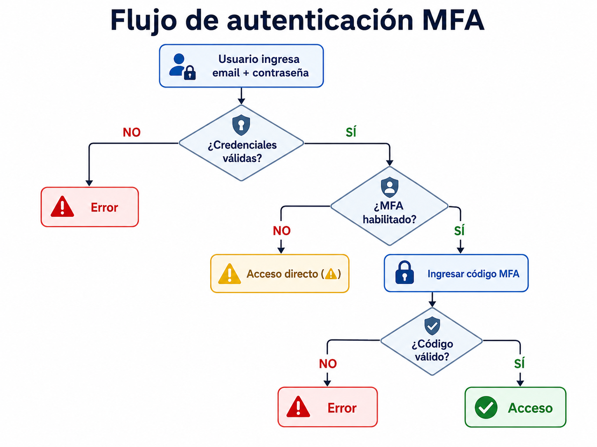
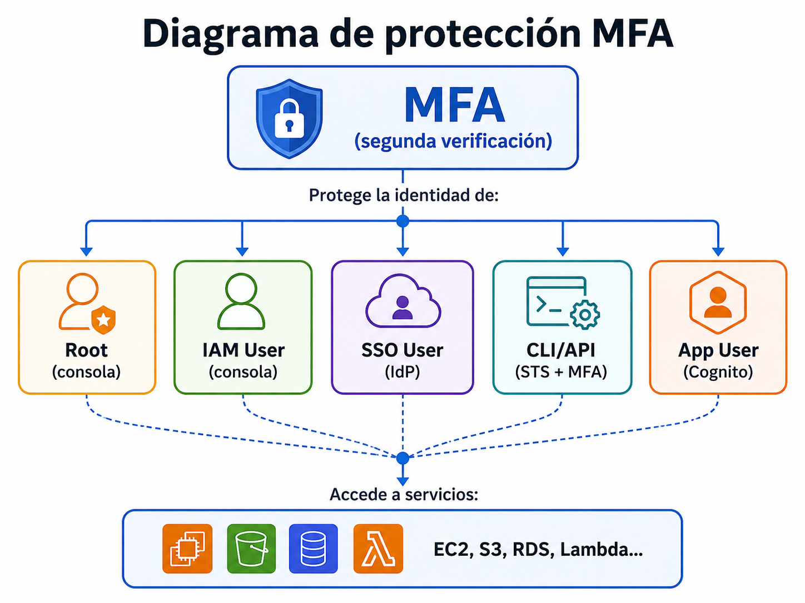

# Habilitar MFA en root, IAM users e IdP

| Campo | Definición |
|-------|------------|
| **Servicio principal** | IAM / IAM Identity Center / Cognito |
| **Prioridad** | Alta |
| **Objetivo** | Reducir acceso no autorizado ante robo o exposición de credenciales |
| **Riesgo mitigado** | Compromiso de cuentas por contraseñas robadas, fuerza bruta, phishing o keyloggers |

---

## ¿Que es y para que sirve?

MFA (Multi-Factor Authenitcation) agrega una **segunda capa de verificacion** al login.
Ademas de tu contraseña (algo que sabemos), necesitas un codigo temporal de un dispositivo

### Analogica

Pensalo como una **boveda de banco**: no alcanza con tener la llave (contraseña), tambien neceistas la huella digital (MFA). Si alguien roba tu llave, no puede entrar sin tu huella

### Tipos de MFA en AWS


| Tipo | Ejemplo | Seguridad | Recomendación |
|------|---------|-----------|---------------|
| **Virtual MFA** | Google Authenticator, Authy, Microsoft Authenticator | ⭐⭐⭐ | Mínimo recomendado |
| **FIDO2 Security Key** | YubiKey, Titan Key | ⭐⭐⭐⭐⭐ | Ideal para root |
| **Hardware TOTP** | Token físico tipo llavero | ⭐⭐⭐⭐ | Para entornos regulados |

### ¿Donde aplicar el MFA?


| ¿Dónde? | ¿Por qué? | ¿Cómo? |
|----------|-----------|--------|
| **Root** | Identidad con poder ilimitado | Consola → Security credentials → MFA |
| **IAM Users con consola** | Cualquier usuario que accede a la consola | IAM → Users → Security credentials → MFA |
| **IAM Identity Center** | Usuarios federados | Configurar MFA obligatorio en el IdP |
| **Cognito (CIAM)** | Usuarios de aplicaciones | Configurar MFA en User Pool |

> **En resumen:** si alguien tiene acceso a la consola, necesita MFA. Sin excepciones.


## ¿Como funciona?

### Flujo de autenticacion con MFA



### Buenas practicas 

- Habilitar MFA en root de **todas** las cuentas
- Requerir MFA en usuarios IAM con acceso a consola
- Priorizar **IAM Identity Center** y roles temporales sobre IAM users
- Exigir MFA desde el proveedor de identidad corporativo
- Evaluar MFA en aplicaciones criticas de clientes mediante CIAM/Cognito

---

##  Relación con otros servicios

| Se relaciona con | Tipo | ¿Cómo? |
|---|---|---|
| **IAM** | Directo | MFA es una funcionalidad nativa de IAM. Se habilita por usuario/rol |
| **S3 (MFA Delete)** | Directo | S3 soporta "MFA Delete": requiere MFA para eliminar objetos versionados. Protege contra borrado accidental/malicioso |
| **Organizations / SCPs** | Directo | Podés crear una SCP que fuerce MFA para ciertas acciones en toda la organización |
| **STS** | Directo | Para usar MFA con CLI, llamás a `sts:GetSessionToken` pasando el código MFA y obtenés credenciales temporales |
| **CloudTrail** | Indirecto | Registra eventos de MFA: habilitación, deshabilitación, uso en login |
| **Security Hub** | Indirecto | Tiene controles que verifican: root MFA habilitado, usuarios sin MFA, password policy |
| **GuardDuty** | Indirecto | Detecta si credenciales sin MFA se usan de forma sospechosa |
| **EC2 / RDS / Lambda / etc.** | Indirecto | MFA protege la identidad que accede a estos servicios. Si un usuario tiene MFA, todas sus acciones están más protegidas |


### Diagrama de proteccion MFA




## Consola

> Ver capturas en [`consola/screenshots.md`](./consola/screenshots.md)

### Habilitar MFA en Root

1. Login como root → click en nombre de cuenta → **Security credentials**
2. Sección **Multi-factor authentication (MFA)**
3. Click **Assign MFA device**
4. Elegir tipo (Virtual MFA / Security Key / Hardware TOTP)
5. Escanear QR con la app → ingresar 2 códigos consecutivos

### Habilitar MFA en IAM User

1. IAM → **Users** → seleccionar usuario
2. Tab **Security credentials**
3. Sección **Multi-factor authentication (MFA)**
4. Click **Assign MFA device**

### Verificar estado MFA (Credential Report)

1. IAM → **Credential report**
2. Click **Download Report**
3. Revisar columnas: `mfa_active`, `password_enabled`

---

## ⌨️ 5. CLI + Terraform

> Ver archivos completos en [`cli-terraform/`](./cli-terraform/)

### CLI - Ver dispositivos MFA

```bash
aws iam list-virtual-mfa-devices
```

### CLI - Verificar MFA del root (via Credential Report)

```bash
# Generar reporte
aws iam generate-credential-report

# Descargar y decodificar
aws iam get-credential-report \
  --query 'Content' --output text | base64 -d | head -5
```

### CLI - Verificar resumen de cuenta (MFA root)

```bash
aws iam get-account-summary \
  --query '{MFAEnabled: AccountMFAEnabled, Users: Users, MFADevices: MFADevicesInUse}'
```

### CLI - Crear MFA virtual para un usuario

```bash
aws iam create-virtual-mfa-device \
  --virtual-mfa-device-name my-mfa-device \
  --outfile /tmp/QRCode.png \
  --bootstrap-method QRCodePNG
```

### CLI - Habilitar MFA en un usuario

```bash
aws iam enable-mfa-device \
  --user-name mi-usuario \
  --serial-number arn:aws:iam::123456789012:mfa/my-mfa-device \
  --authentication-code1 123456 \
  --authentication-code2 789012
```

> ⚠️ **Nota**: MFA del root solo se puede habilitar desde la **consola**.
> No hay comando CLI para habilitar MFA en root.

### CLI - Usar MFA con CLI (obtener session token)

```bash
aws sts get-session-token \
  --serial-number arn:aws:iam::123456789012:mfa/mi-usuario \
  --token-code 123456 \
  --duration-seconds 3600
```

### Terraform - Password Policy fuerte

```hcl
resource "aws_iam_account_password_policy" "strict" {
  minimum_password_length        = 14
  require_lowercase_characters   = true
  require_uppercase_characters   = true
  require_numbers                = true
  require_symbols                = true
  allow_users_to_change_password = true
  max_password_age               = 90
  password_reuse_prevention      = 24
  hard_expiry                    = false
}
```

### Terraform - Policy para forzar MFA

```hcl
resource "aws_iam_policy" "force_mfa" {
  name        = "ForceMFA"
  description = "Deniega acciones si no hay MFA activo, excepto autogestión de MFA"

  policy = jsonencode({
    Version = "2012-10-17"
    Statement = [
      {
        Sid    = "AllowManageOwnMFA"
        Effect = "Allow"
        Action = [
          "iam:CreateVirtualMFADevice",
          "iam:DeleteVirtualMFADevice",
          "iam:EnableMFADevice",
          "iam:ResyncMFADevice",
          "iam:ListMFADevices",
          "iam:ListVirtualMFADevices",
          "iam:DeactivateMFADevice"
        ]
        Resource = [
          "arn:aws:iam::*:mfa/$${aws:username}",
          "arn:aws:iam::*:user/$${aws:username}"
        ]
      },
      {
        Sid    = "AllowListActions"
        Effect = "Allow"
        Action = [
          "iam:ListUsers",
          "iam:ListVirtualMFADevices",
          "iam:GetAccountPasswordPolicy",
          "iam:GetAccountSummary"
        ]
        Resource = "*"
      },
      {
        Sid       = "DenyAllExceptMFAManagement"
        Effect    = "Deny"
        NotAction = [
          "iam:CreateVirtualMFADevice",
          "iam:EnableMFADevice",
          "iam:ResyncMFADevice",
          "iam:ListMFADevices",
          "iam:ListVirtualMFADevices",
          "iam:ListUsers",
          "iam:GetAccountPasswordPolicy",
          "iam:GetAccountSummary",
          "sts:GetSessionToken",
          "iam:ChangePassword"
        ]
        Resource = "*"
        Condition = {
          BoolIfExists = {
            "aws:MultiFactorAuthPresent" = "false"
          }
        }
      }
    ]
  })
}
```

---