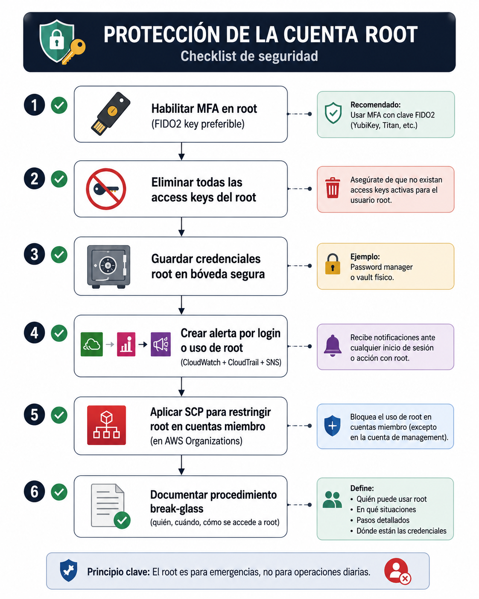
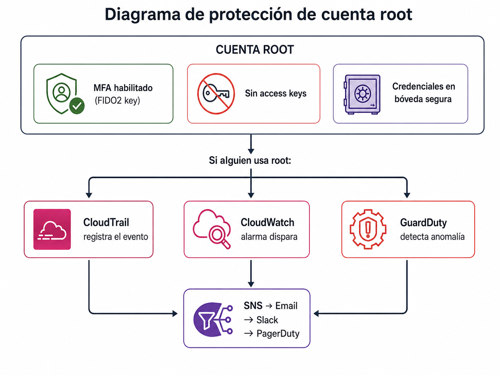

# Proteger la cuenta root


| Campo | Definición |
|-------|------------|
| **Servicio principal** | IAM / AWS Organizations / SCP / CloudTrail |
| **Prioridad** | Alta |
| **Objetivo** | Evitar uso cotidiano de root, eliminar credenciales duraderas y auditar cualquier actividad root |
| **Riesgo mitigado** | Compromiso de identidad con privilegios ilimitados y baja trazabilidad individual |

---

## ¿Que es y para que sirve?

La cuenta **root** es la identidad con **poder ilimitado** en AWS, No tiene restricciones de IAM policies (es basicamente dios en la cuenta). Puede cerrar la cuenta, cambiar datos de pago, modificar contactos y hacer absolutamente todo

### Analogia

Es la **llave maestra de todo el edificio**, abre cualquier puerta, desactiva cualquier alarma, accede a cualquier caja fuerte. Nadie la lleva encima de forma cotidiana: se guarda en una boveda con acceso restringido y solo se saca de emergencias (procedimiento *breack-glass*)

### ¿Cuando SI necesitamos Root?

Casi nunca. Solo para tareas especificas:
- Cambiar el plan de soporte
- Cerrar la cuenta AWS
- Cambiar datos de pago o el email de la cuenta
- Restaurar permisos IAM si se desbloquearon accidentalmente
- Habilitar MFA delente en S3

Para **todo lo demas**, utiliza un usuario/rol IAM con permisos de administrador

> **En resumen:** root no se usa, se protege. Punto.

---

### ¿Como funciona?

### Checklist de proteccion del root





### Procedimiento Break-glass

Es el protocologo para cuando **necesitas usar root** en una emergencia:

1. **Solicitud** -> El responsable pide acceso documentando el motivo
2. **Aprobacion** -> Un segundo responsable aprueba (4 ojos)
3. **Acceso** -> Se obtienen las credenciales root de la boveda
4. **Uso** -> Se ejecuta la tarea especifica
5. **Rotacion**_ -> Se rota la contraseña root despues del uso
6. **Registro** -> Se documenta que se hizo, quien, cuando y porque

### Buenas Practicas

- No usar root para tareas diarias
- Eliminar access keys root
- Guardar credenciales root en boveda segura
- Crear alertas por login o uso root
- Evaluar SCPs para restringir root en cuentas miembro


## Relacion con otros servicios


| Se relaciona con | Tipo | ¿Cómo? |
|---|---|---|
| **IAM** | Directo | Root es la identidad principal de la cuenta. Todas las demás identidades se crean desde IAM |
| **MFA (Módulo 4)** | Directo | MFA es la primera línea de defensa del root. Sin MFA, root queda expuesto |
| **Organizations / SCPs** | Directo | SCPs pueden restringir qué puede hacer root en cuentas miembro (aunque no en la management account) |
| **CloudTrail** | Directo | Registra TODAS las acciones de root. Es la fuente para crear alertas |
| **CloudWatch** | Directo | Se crea un metric filter sobre los logs de CloudTrail para detectar login de root → alarma |
| **EventBridge** | Directo | Alternativa a CloudWatch: regla que detecta evento `ConsoleLogin` con `Root` → notificación |
| **SNS** | Directo | Recibe la notificación de la alarma y la envía por email/Slack |
| **GuardDuty** | Indirecto | Detecta uso anómalo de credenciales root (ej: login desde IP inusual) |
| **Security Hub** | Indirecto | Controles que verifican: root sin access keys, root con MFA, root sin uso en 90 días |


### Diagrama de proteccion en la cuenta root




##  Consola

> Ver capturas en [`consola/screenshots.md`](./consola/screenshots.md)

### Verificar acces keys del root

1. Login como root -> nombre de cuenta -> **Security credentials**
2. Seccion **Access keys**
3. Verificar que **no existen** access keys activas

### Verificar MFA del root

1. Misma pagina -> seccion **Multi-factor authentication (MFA)**
2. Verificar que tenga un dispositivo MFA asignado

### Credential Report

1. IAM -> **Credential report** -> **Download Report**
2. Fila `<root_account>` : verificar `mfa_active = true`, `access_key_1_active = false`

---

## CLI + Terraform 

> Ver archivos completos en [`cli-terraform/`](./cli-terraform/)

### CLI - Verficar si root tiene access keys

```bash
# generar y descargar credential report
aws iam generate-credential-report
sleep 5
aws iam get-credential-report \
    --query 'content' --output text | base64 -d | \ 
    grep '<root_account>' | cut -d ',' -f1,4,9,11,4
```

### CLI - Verificar MFA del root

```bash
aws iam get-account-summary \
    --query '{AccountMFAEnabled: AccountMFAEnabled}'
# Resultado esperado: AccountMFAEnabled: 1
```

### CLI + Verificar resumen completo

```bash
aws iam get-account-summary \
    --query '{
        MFAEnabled: AccountMFAEnabled,
        Users: Users,
        AccessKeyPerUser: AccessKeyPerUserQuota,
        MFADevicesInUse: MFADeviceInUse
    }'
``` 

### Terraform - Alarma por login de root

```hcl
# Metric filter sobre CloudTrail log group para detectar login de root
resource "aws_cloudwatch_log_metric_filter" "root_login" {
  name           = "RootAccountLogin"
  pattern        = "{ $.userIdentity.type = \"Root\" && $.userIdentity.invokedBy NOT EXISTS && $.eventType != \"AwsServiceEvent\" }"
  log_group_name = var.cloudtrail_log_group_name

  metric_transformation {
    name      = "RootAccountLoginCount"
    namespace = "SecurityMetrics"
    value     = "1"
  }
}

# Alarma que se dispara cuando root hace login
resource "aws_cloudwatch_metric_alarm" "root_login" {
  alarm_name          = "RootAccountLoginAlarm"
  alarm_description   = "ALERTA: Se detectó login de la cuenta Root"
  comparison_operator = "GreaterThanOrEqualToThreshold"
  evaluation_periods  = 1
  metric_name         = "RootAccountLoginCount"
  namespace           = "SecurityMetrics"
  period              = 300
  statistic           = "Sum"
  threshold           = 1
  treat_missing_data  = "notBreaching"

  alarm_actions = [var.sns_topic_arn]
}
```

### Terraform - SCP para restringir root en cuentas miembro

```hcl
resource "aws_organizations_policy" "deny_root_actions" {
  name        = "DenyRootInMemberAccounts"
  description = "Bloquea acciones de root en cuentas miembro"
  type        = "SERVICE_CONTROL_POLICY"

  content = jsonencode({
    Version = "2012-10-17"
    Statement = [
      {
        Sid       = "DenyRootActions"
        Effect    = "Deny"
        Action    = "*"
        Resource  = "*"
        Condition = {
          StringLike = {
            "aws:PrincipalArn" = "arn:aws:iam::*:root"
          }
        }
      }
    ]
  })
}
```

---


##  Referencias

- [AWS - Root user best practices](https://docs.aws.amazon.com/IAM/latest/UserGuide/id_root-user.html)
- [AWS - Tasks that require root user credentials](https://docs.aws.amazon.com/IAM/latest/UserGuide/root-user-tasks.html)
- [AWS Maturity Model - Root Protection](https://maturitymodel.security.aws.dev/es/1.-quickwins/root-protection/)
