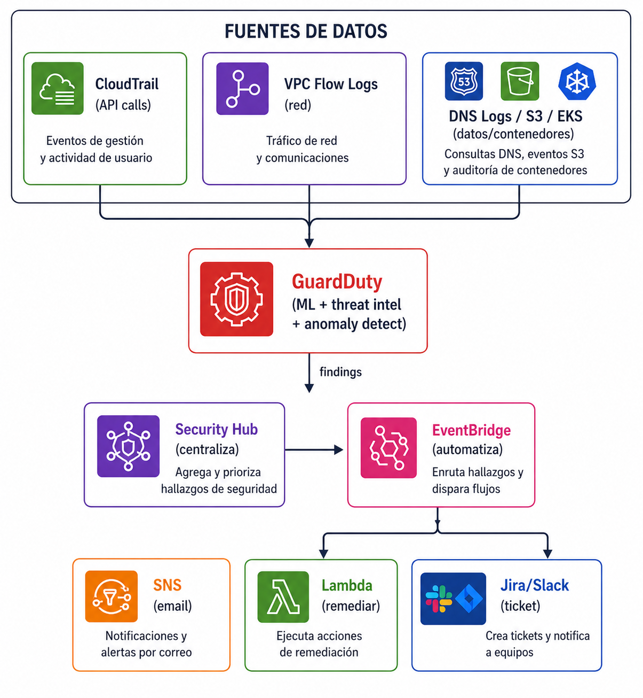

# Deteccion de Amenazas 

## Descripcion 

Sin deteccion, estas volando a ciegas. Este dominio cubre los servicios que te permiten **saber que pasa** en tu cuenta de AWS: quien hizo que (CloudTrail), si hay actividad maliciosa (GuardDuty), y si te estan cobrando de mas por algo inesperado (Billing Alarms).

Se trabajan **3 QuickWins**:

| # | QuickWin | Servicio principal | Prioridad |
|---|----------|-------------------|-----------| 
| 8 | [Detección de amenazas comunes (GuardDuty)](./guardduty.md) | Amazon GuardDuty | Alta |
| 9 | [Auditoría de llamadas a APIs (CloudTrail)](./cloudtrail.md) | AWS CloudTrail | Alta |
| 10 | [Alarmas de Billing y costos anómalos](./alarma-billing.md) | AWS Budgets / Cost Anomaly Detection | Alta |

## ¿Por qué la detección es crítica?

```
Sin detección:                       Con detección:

  Atacante entra                       Atacante entra
       │                                    │
       ▼                                    ▼
  Crea recursos                        CloudTrail registra
       │                                    │
       ▼                                    ▼
  Mina crypto                          GuardDuty detecta
       │                                    │
       ▼                                    ▼
  Factura de $50,000                   Alerta inmediata
       │                                    │
       ▼                                    ▼
  Te enterás a fin de mes              Respondés en minutos
  (si revisás la factura)              Billing alarm avisa del gasto
```

##  Flujo de deteccion integrado:




## Estructura de archivos

```
04-deteccion-amenazas/
├── README.md                    ← estás acá
├── guardduty.md                 ← Quick Win 8
├── cloudtrail.md                ← Quick Win 9
├── alarma-billing.md            ← Quick Win 10
├── consola/
│   └── screenshots.md           ← capturas de la consola
└── cli-terraform/
    ├── commands.sh              ← comandos AWS CLI
    └── main.tf                  ← infraestructura como código
```