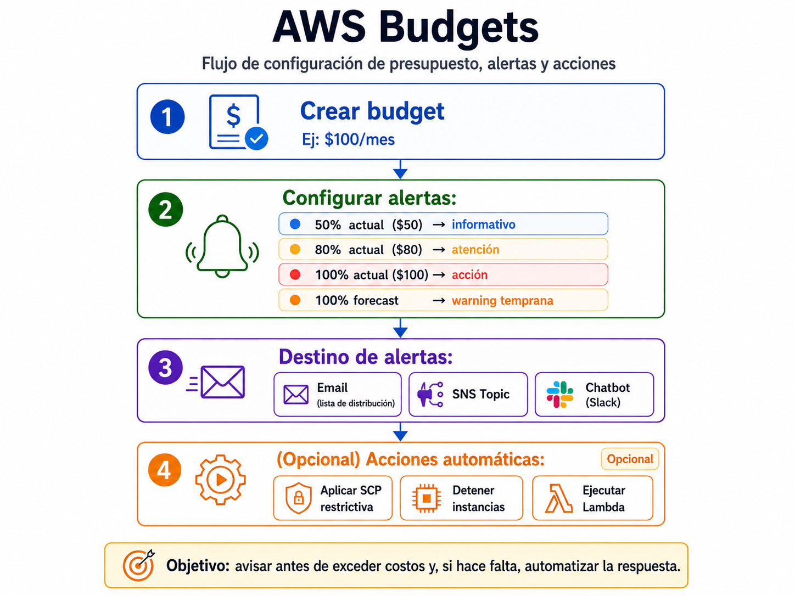
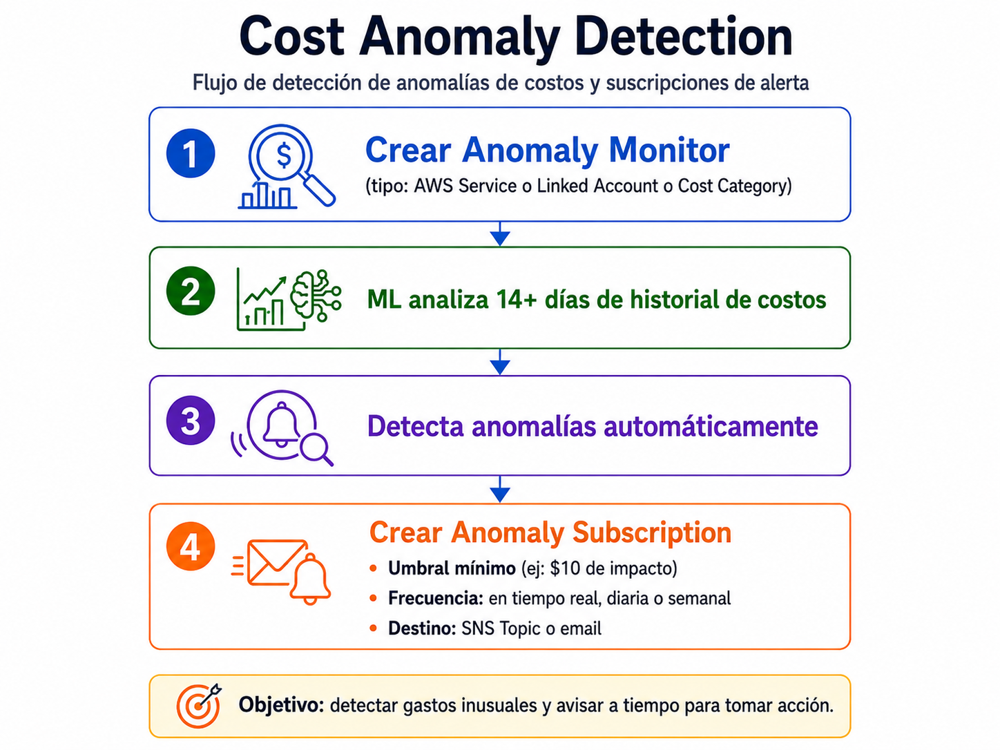
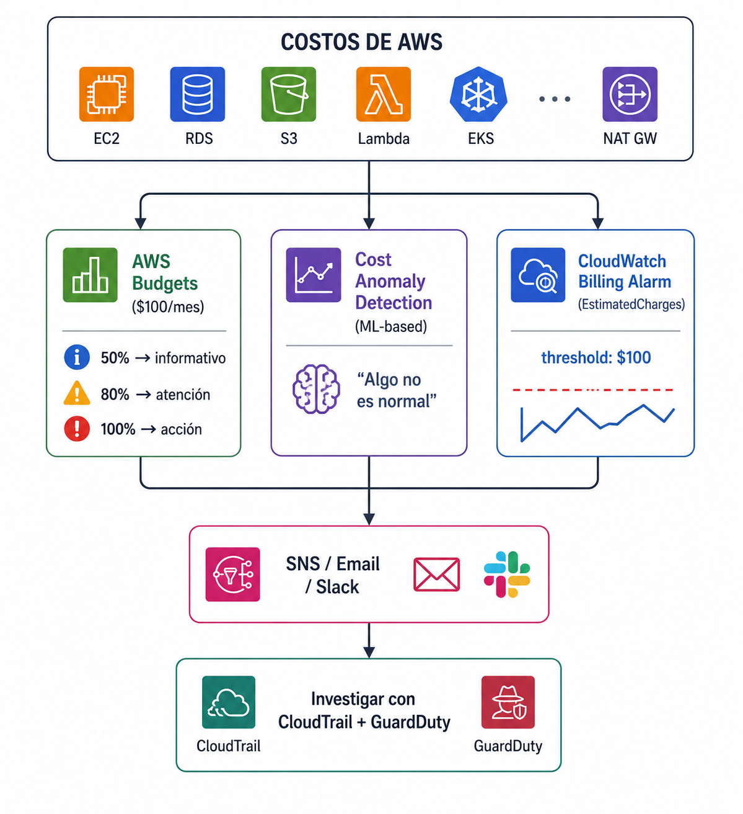

# Configurar alarmas de billing y costos anomalos


| Campo | Definición |
|-------|------------|
| **Servicio principal** | AWS Budgets / Cost Anomaly Detection / CloudWatch Billing |
| **Prioridad** | Alta |
| **Objetivo** | Detectar costos inesperados por errores operativos o abuso de infraestructura |
| **Riesgo mitigado** | Impacto financiero por recursos olvidados, mal configurados o creados por credenciales comprometidas |

---

## ¿Que es y para que sirve?

Una de las señales mas visibles de un incidente de seguridad es un **pico inesperado en la factura**. Si alguien compromete tus credenciales y levanta 50 instancias para minar crypto, lo primero que vas a notar es el costo.

Tambien protege contra errores operativos: dejaste una instancia p3.16xlarge corriendo un viernes y te levantas el lunes con una factura de $2.0000

### Analogia 

Es como la **Alerta de tu banco**: "Tu cuenta tuvo un gasto de $500 superior al promedio. ¿Fuiste vos?" Si no configuras alertas, te enteras cuando llega el resumen de la tarjeta (a fin de mes)


### Dos servicios, dos enfoques

| Servicio | Enfoque | Cómo funciona |
|----------|---------|---------------|
| **AWS Budgets** | Manual | Vos definís un presupuesto mensual y umbrales (50%, 80%, 100%) → alerta cuando se cruza |
| **Cost Anomaly Detection** | Inteligente | ML analiza tu patrón de gasto histórico → alerta cuando detecta algo fuera de lo normal |

> **En resumen:** configurá ambos. Budgets te dice "vas a gastar más de lo planeado".
> Cost Anomaly Detection te dice "esto no es normal".

---

## ¿Como funciona?



### Cost Anomaly Detection



### Buenas practicas 

- Crear budget mensual global y por cuenta/servicio si aplica
- Configurar alertas al **50%, 80%, 100% y forecast**
- Habilitar **Cost Anomaly Detection**
- Enviar alertas a lista monitoreada por Cloud/FinOps/Seguridad
- Investigar gastos inesperados junto con **CloudTrail y GuardDuty**


## Relacion con otros Servicios


| Se relaciona con | Tipo | ¿Cómo? |
|---|---|---|
| **CloudWatch** | Directo | Billing alarms clásicas usan métricas de CloudWatch (`EstimatedCharges`) |
| **SNS** | Directo | Destino de las notificaciones de budget y anomalías |
| **Organizations** | Directo | Consolidated billing permite ver costos de todas las cuentas. Budgets se pueden crear por cuenta miembro |
| **CloudTrail** | Investigación | Cuando hay un pico de costos, usás CloudTrail para ver qué recursos se crearon y quién los creó |
| **GuardDuty** | Investigación | Si el pico es por credenciales comprometidas, GuardDuty probablemente tiene findings correlacionados |
| **Lambda** | Automatización | Budget actions pueden ejecutar Lambda para remediar (ej: detener instancias) |
| **Cost Explorer** | Análisis | Visualizar tendencias de costos y drill-down por servicio/cuenta/tag |
| **AWS Chatbot** | Notificaciones | Enviar alertas directamente a Slack u otros servicios |

### Diagrama



## Consola

> Ver capturas en [`consola/screenshots.md`](./consola/screenshots.md)

### Crear Budget

1. AWS Console -> **Billing and Cost Management** -> **Budgets**
2. Click **Create Budget**
3. Elegir tipo: **Cost budget** (recomendado para empezar)
4. Definir monto mensual
5. Configurar alertas (50%, 80%, 100%, forecast)
6. Agregar email recipients

### Habilitar Cost Anomaly Detection

1. AWS Console -> **Cost Management** -> **Cost Anomaly Detection**
2. Select metric -> **Billing** -> **Total Estimated Charge**
3. Conditions: Greate than $100 (o tu umbral)
4. Notifications -> SNS topic

---

## CLI + Terraform 

> Ver archivos completos en [`cli-terraform/`](./cli-terraform/)

### CLI - Crear budget mensual

```bash
aws budgets create-budget \
  --account-id $(aws sts get-caller-identity --query Account --output text) \
  --budget '{
    "BudgetName": "Monthly-Total",
    "BudgetLimit": {"Amount": "100", "Unit": "USD"},
    "TimeUnit": "MONTHLY",
    "BudgetType": "COST"
  }' \
  --notifications-with-subscribers '[
    {
      "Notification": {
        "NotificationType": "ACTUAL",
        "ComparisonOperator": "GREATER_THAN",
        "Threshold": 80,
        "ThresholdType": "PERCENTAGE"
      },
      "Subscribers": [
        {"SubscriptionType": "EMAIL", "Address": "security-team@empresa.com"}
      ]
    },
    {
      "Notification": {
        "NotificationType": "FORECASTED",
        "ComparisonOperator": "GREATER_THAN",
        "Threshold": 100,
        "ThresholdType": "PERCENTAGE"
      },
      "Subscribers": [
        {"SubscriptionType": "EMAIL", "Address": "security-team@empresa.com"}
      ]
    }
  ]'
```

### CLI - Crer anomaly monitor

```bash
aws ce create-anomaly-monitor \
  --anomaly-monitor '{
    "MonitorName": "ServiceMonitor",
    "MonitorType": "DIMENSIONAL",
    "MonitorDimension": "SERVICE"
  }'
```

### CLI - Crear anomaly subscription

```bash
aws ce create-anomaly-subscription \
  --anomaly-subscription '{
    "SubscriptionName": "SecurityAlerts",
    "MonitorArnList": ["arn:aws:ce::123456789012:anomalymonitor/monitor-id"],
    "Subscribers": [
      {"Type": "EMAIL", "Address": "security-team@empresa.com"}
    ],
    "Frequency": "DAILY",
    "ThresholdExpression": {
      "Dimensions": {
        "Key": "ANOMALY_TOTAL_IMPACT_ABSOLUTE",
        "MatchOptions": ["GREATER_THAN_OR_EQUAL"],
        "Values": ["10"]
      }
    }
  }'
```

### Terraform 

```hcl
# Budget mensual con alertas
resource "aws_budgets_budget" "monthly" {
  name         = "Monthly-Total"
  budget_type  = "COST"
  limit_amount = "100"
  limit_unit   = "USD"
  time_unit    = "MONTHLY"

  notification {
    comparison_operator = "GREATER_THAN"
    notification_type   = "ACTUAL"
    threshold           = 50
    threshold_type      = "PERCENTAGE"
    subscriber_email_addresses = [var.alert_email]
  }

  notification {
    comparison_operator = "GREATER_THAN"
    notification_type   = "ACTUAL"
    threshold           = 80
    threshold_type      = "PERCENTAGE"
    subscriber_email_addresses = [var.alert_email]
  }

  notification {
    comparison_operator = "GREATER_THAN"
    notification_type   = "ACTUAL"
    threshold           = 100
    threshold_type      = "PERCENTAGE"
    subscriber_email_addresses = [var.alert_email]
  }

  notification {
    comparison_operator = "GREATER_THAN"
    notification_type   = "FORECASTED"
    threshold           = 100
    threshold_type      = "PERCENTAGE"
    subscriber_email_addresses = [var.alert_email]
  }
}

# Cost Anomaly Detection
resource "aws_ce_anomaly_monitor" "service" {
  name              = "ServiceAnomalyMonitor"
  monitor_type      = "DIMENSIONAL"
  monitor_dimension = "SERVICE"
}

resource "aws_ce_anomaly_subscription" "alerts" {
  name      = "CostAnomalyAlerts"
  frequency = "DAILY"

  monitor_arn_list = [aws_ce_anomaly_monitor.service.arn]

  subscriber {
    type    = "EMAIL"
    address = var.alert_email
  }

  threshold_expression {
    dimension {
      key           = "ANOMALY_TOTAL_IMPACT_ABSOLUTE"
      match_options = ["GREATER_THAN_OR_EQUAL"]
      values        = ["10"]
    }
  }
}
```

---


##  Referencias

- [AWS Maturity Model - Billing Alarm](https://maturitymodel.security.aws.dev/es/1.-quickwins/billing-alarm/)
- [AWS - Creating a cost budget](https://docs.aws.amazon.com/cost-management/latest/userguide/budgets-create.html)
- [Terraform - aws_budgets_budget](https://registry.terraform.io/providers/hashicorp/aws/latest/docs/resources/budgets_budget)
- [Terraform - aws_ce_anomaly_monitor](https://registry.terraform.io/providers/hashicorp/aws/latest/docs/resources/ce_anomaly_monitor)

