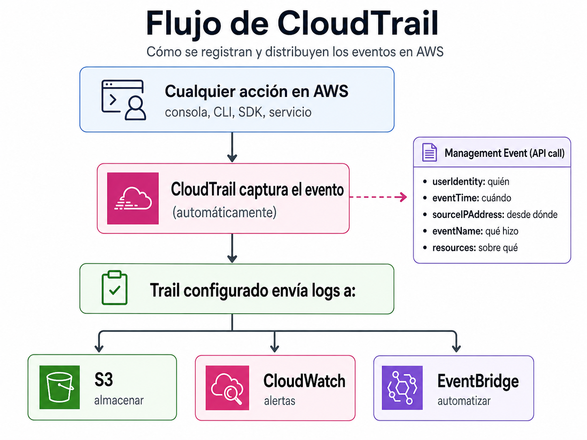
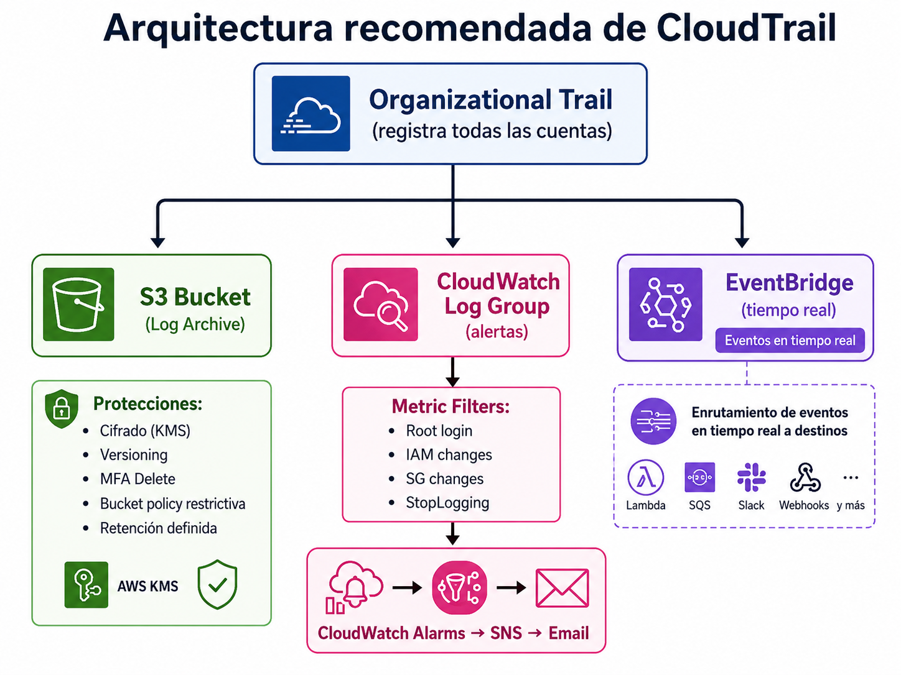

# Auditoria de llamadas de API con CloudTrail

| Campo | Definición |
|-------|------------|
| **Servicio principal** | AWS CloudTrail / S3 / CloudWatch / EventBridge |
| **Prioridad** | Alta |
| **Objetivo** | Registrar quién hizo qué, cuándo, desde dónde y sobre qué recurso |
| **Riesgo mitigado** | Falta de trazabilidad y evidencia para investigar incidentes o cambios críticos |

---

## ¿Que es y para que sirve?

AWS CloudTrail es el **registro de auditoria** de tu cuenta de AWS. Registra **Toda llamada a la API** de AWS: quien la hizo, desde que IP, cuando, que accion y sobre que recurso

### Analogia

Es el **sistema de CCTV del edificio**: graba cada entrada, cada salida, cada accion. Si mañana alguien borra una base de datos, podes rebobinar la cinta y ver exactamente quien fue, a que hora, desde que computadora, etc.

Sin las grabaciones, no tenes forma de investigar el incidente

### Tipos de eventos


| Tipo | Qué registra | Costo | Ejemplo |
|------|-------------|-------|---------|
| **Management Events** | Llamadas a APIs de gestión | 1 trail gratis | `CreateBucket`, `RunInstances`, `DeleteUser` |
| **Data Events** | Operaciones sobre datos | Costo adicional | `GetObject` en S3, `Invoke` en Lambda |
| **Insights Events** | Actividad anómala de APIs | Costo adicional | Pico inusual de `DeleteObject` |

> **En resumen:** CloudTrail es la "caja negra" de tu cuenta AWS.
> Si no tenés CloudTrail, no tenés evidencia. Si no tenés evidencia, no tenés seguridad.

---

## ¿Como funciona?

### Flujo de CloudTrail



### Arquitectura recomendada



### Buenas prácticas 

- Crear **organizational trail**
- Centralizar logs en **Log Archive Account**
- Proteger bucket con cifrado, versioning, políticas restrictivas y retención
- Alertar eventos críticos: root, cambios IAM, cambios SG, StopLogging/DeleteTrail
- Capacitar al equipo para investigar eventos CloudTrail

## Relacion con otros servicios

| Se relaciona con | Tipo | ¿Cómo? |
|---|---|---|
| **S3** | Almacenamiento | Los logs de CloudTrail se almacenan en un bucket S3. Proteger este bucket es crítico |
| **CloudWatch Logs** | Alertas | Enviar eventos a CW para crear metric filters y alarmas (root login, IAM changes) |
| **EventBridge** | Tiempo real | Reglas que reaccionan a eventos específicos de CloudTrail en tiempo real |
| **IAM** | Registro | Registra TODAS las acciones IAM: creación de usuarios, cambios de permisos, logins |
| **GuardDuty** | Fuente de datos | GuardDuty consume los management events de CloudTrail para detectar amenazas |
| **Security Hub** | Compliance | Controles que verifican: trail habilitado, cifrado, multi-región, log file validation |
| **Organizations** | Multi-cuenta | Organizational trail registra eventos de todas las cuentas miembro |
| **KMS** | Cifrado | Se usan KMS keys para cifrar los logs en reposo |
| **Athena** | Análisis | Podés usar Athena para consultar logs de CloudTrail con SQL directo en S3 |
| **SNS** | Notificaciones de delivery | Notifica cuando se entregan nuevos archivos de logs al bucket |

### Diagrama

```
Toda acción AWS ──► CloudTrail ──► S3 (almacenar)
                        │              │
                        │              ├── KMS (cifrar)
                        │              ├── Versioning (proteger)
                        │              └── Lifecycle (retener)
                        │
                        ├──► CloudWatch Logs ──► Metric Filters ──► Alarms ──► SNS
                        │    (root login, IAM changes, SG changes)
                        │
                        ├──► EventBridge ──► Lambda / SNS / Step Functions
                        │    (respuesta automática en tiempo real)
                        │
                        ├──► GuardDuty (consume eventos para detectar amenazas)
                        │
                        └──► Athena (consultar logs con SQL)
```

---

##  Consola

> Ver capturas en [`consola/screenshots.md`](./consola/screenshots.md)

### Ver trails existentes

1. AWS Console → **CloudTrail** → **Trails**
2. Verificar que existe al menos un trail activo

### Crear trail

1. CloudTrail → **Create trail**
2. Nombre, S3 bucket (nuevo o existente), cifrado KMS
3. Habilitar **CloudWatch Logs** (crear log group)
4. Seleccionar eventos: Management (siempre), Data (opcional)

### Event History (últimos 90 días)

1. CloudTrail → **Event history**
2. Filtrar por: Event name, User name, Resource type, Time range
3. Útil para investigación rápida sin necesidad de Athena

---

##  CLI + Terraform

> Ver archivos completos en [`cli-terraform/`](./cli-terraform/)

### CLI - Ver trails existentes

```bash
aws cloudtrail describe-trails \
  --query 'trailList[].{Name:Name,S3Bucket:S3BucketName,IsOrg:IsOrganizationTrail,IsMultiRegion:IsMultiRegionTrail}' \
  --output table
```

### CLI - Ver estado de un trail

```bash
aws cloudtrail get-trail-status --name mi-trail
```

### CLI - Buscar eventos recientes (últimos 90 días)

```bash
# Eventos de un usuario específico
aws cloudtrail lookup-events \
  --lookup-attributes AttributeKey=Username,AttributeValue=mi-usuario \
  --max-results 10 \
  --query 'Events[].{Time:EventTime,Name:EventName,User:Username,Source:EventSource}'

# Eventos de un tipo específico
aws cloudtrail lookup-events \
  --lookup-attributes AttributeKey=EventName,AttributeValue=ConsoleLogin \
  --max-results 10

# Eventos de root
aws cloudtrail lookup-events \
  --lookup-attributes AttributeKey=Username,AttributeValue=root \
  --max-results 10
```

### CLI - Crear trail con logging a S3

```bash
aws cloudtrail create-trail \
  --name mi-trail-organizacional \
  --s3-bucket-name mi-bucket-cloudtrail-logs \
  --is-multi-region-trail \
  --enable-log-file-validation \
  --include-global-service-events

# Iniciar logging
aws cloudtrail start-logging --name mi-trail-organizacional
```

### Terraform

```hcl
# Bucket S3 para logs de CloudTrail
resource "aws_s3_bucket" "cloudtrail_logs" {
  bucket        = "cloudtrail-logs-${data.aws_caller_identity.current.account_id}"
  force_destroy = false
}

# Habilitar versioning en el bucket
resource "aws_s3_bucket_versioning" "cloudtrail_logs" {
  bucket = aws_s3_bucket.cloudtrail_logs.id
  versioning_configuration {
    status = "Enabled"
  }
}

# Bloquear acceso público al bucket
resource "aws_s3_bucket_public_access_block" "cloudtrail_logs" {
  bucket = aws_s3_bucket.cloudtrail_logs.id

  block_public_acls       = true
  block_public_policy     = true
  ignore_public_acls      = true
  restrict_public_buckets = true
}

# Bucket policy para permitir CloudTrail
resource "aws_s3_bucket_policy" "cloudtrail_logs" {
  bucket = aws_s3_bucket.cloudtrail_logs.id

  policy = jsonencode({
    Version = "2012-10-17"
    Statement = [
      {
        Sid       = "AWSCloudTrailAclCheck"
        Effect    = "Allow"
        Principal = { Service = "cloudtrail.amazonaws.com" }
        Action    = "s3:GetBucketAcl"
        Resource  = aws_s3_bucket.cloudtrail_logs.arn
      },
      {
        Sid       = "AWSCloudTrailWrite"
        Effect    = "Allow"
        Principal = { Service = "cloudtrail.amazonaws.com" }
        Action    = "s3:PutObject"
        Resource  = "${aws_s3_bucket.cloudtrail_logs.arn}/AWSLogs/*"
        Condition = {
          StringEquals = {
            "s3:x-amz-acl" = "bucket-owner-full-control"
          }
        }
      }
    ]
  })
}

# CloudWatch Log Group para CloudTrail
resource "aws_cloudwatch_log_group" "cloudtrail" {
  name              = "cloudtrail-logs"
  retention_in_days = 365
}

# Trail principal
resource "aws_cloudtrail" "main" {
  name                          = "main-trail"
  s3_bucket_name                = aws_s3_bucket.cloudtrail_logs.id
  include_global_service_events = true
  is_multi_region_trail         = true
  enable_log_file_validation    = true
  cloud_watch_logs_group_arn    = "${aws_cloudwatch_log_group.cloudtrail.arn}:*"
  cloud_watch_logs_role_arn     = aws_iam_role.cloudtrail_cloudwatch.arn

  depends_on = [aws_s3_bucket_policy.cloudtrail_logs]
}
```

---

## Referencias

- [AWS CLI - cloudtrail commands](https://docs.aws.amazon.com/cli/latest/reference/cloudtrail/)
- [Terraform - aws_cloudtrail](https://registry.terraform.io/providers/hashicorp/aws/latest/docs/resources/cloudtrail)
- [AWS Maturity Model - CloudTrail](https://maturitymodel.security.aws.dev/es/1.-quickwins/cloudtrail/)
