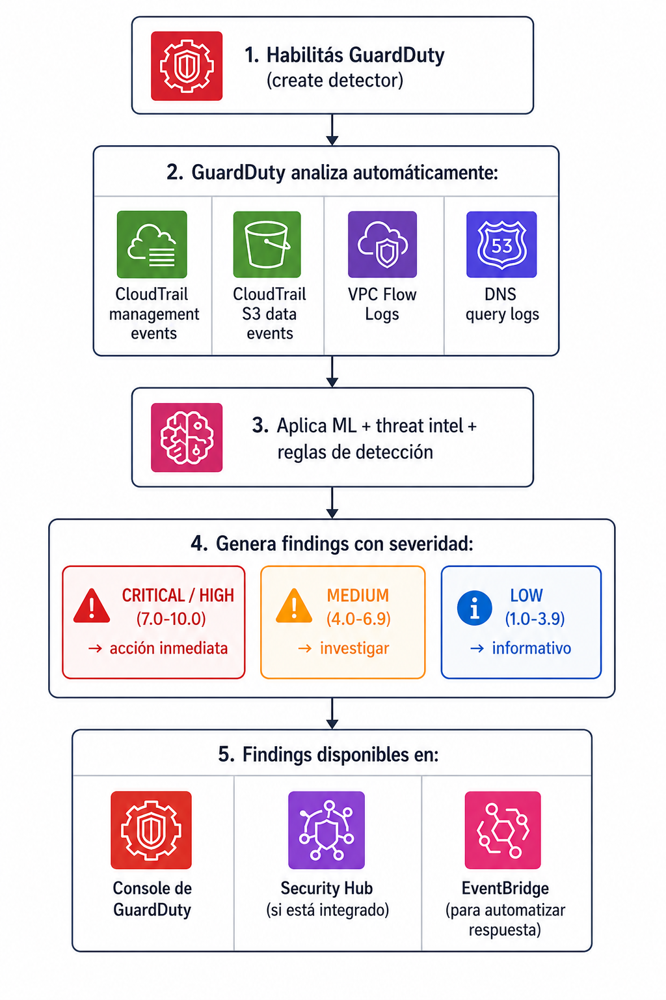
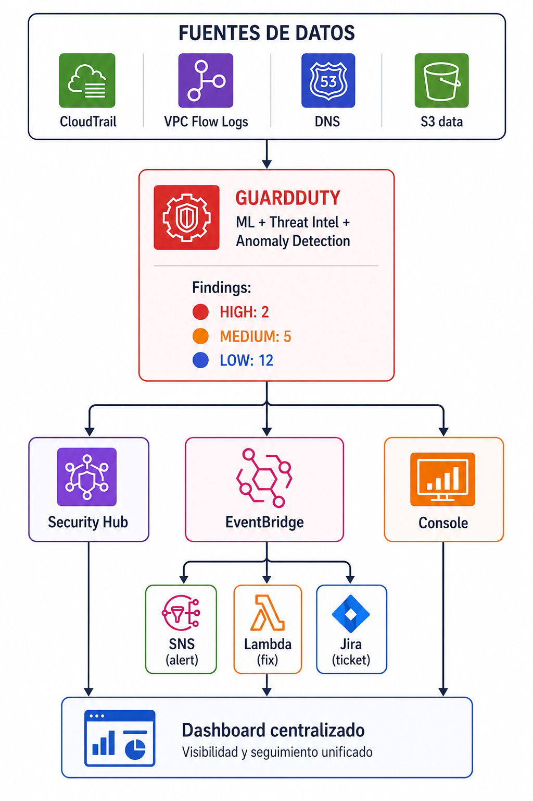

# Deteccion de amenazas con Amazon GuardDuty

| Campo | Definición |
|-------|------------|
| **Servicio principal** | Amazon GuardDuty |
| **Prioridad** | Alta |
| **Objetivo** | Detectar actividad sospechosa, credenciales comprometidas, malware o comunicación maliciosa |
| **Riesgo mitigado** | Detección tardía de amenazas en cuentas, red, S3, EC2, EKS, RDS o Lambda |

---

## ¿Que es y para que sirve?

Amazon GuardDuty es un servicio de **deteccion continua de amenazas** que usa:

- **Machine Learning** para detectar anomalias en el comportamiento
- **Threat Intelligence** (listas de IPs/dominios maliciosos conocidos)
- **Analisis de comportamiento** para identificar patrones sospechosos

No necesitas instalar nada. GuardDuty analiza automaticamente fuentes de datos de AWS y te avisa cuando detecta algo raro

### Analogia

Es como tenes un **sistema de camaras de seguridad con IA** que monitorea tu edificio 24/7. No solo graba (eso lo hace CloudTrail), sino que **analiza** las grabaciones en tiempo real y te avisa: "Ey, hay alguien intentando forzar una puerta" o "esa persona esta actuando de forma sospechosa".

### ¿Que tipo de amenazas detecta?


| Categoría | Ejemplos |
|-----------|----------|
| **Credenciales comprometidas** | Access keys usadas desde IP maliciosa, login desde ubicación inusual |
| **Instancias comprometidas** | EC2 comunicándose con C&C servers, minería de crypto, malware |
| **Acceso anómalo a datos** | Acceso inusual a S3, exfiltración de datos |
| **Actividad de red sospechosa** | Port scanning, conexiones a IPs maliciosas, DNS sospechoso |
| **Kubernetes** | Actividad anómala en EKS clusters |
| **Base de datos** | Intentos de login anómalos a RDS |

> **En resumen:** GuardDuty es tu detector de intrusos inteligente. Siempre encendido,
> sin mantenimiento, con 30 días de trial gratuito.

---

## ¿Como funciona?

### Flujo basico



### Protecciones adicionales (features)

| Feature | Qué protege | Estado recomendado |
|---------|-------------|-------------------|
| **S3 Protection** | Monitorea operaciones en S3 | ✅ Habilitar |
| **EKS Audit Logs** | Analiza logs de Kubernetes | Si usás EKS |
| **EBS Malware Protection** | Escanea volúmenes EC2 por malware | ✅ Habilitar |
| **RDS Login Activity** | Detecta intentos de login anómalos a RDS | Si usás RDS |
| **Lambda Network Activity** | Monitorea tráfico de red de Lambda | Si usás Lambda |
| **Runtime Monitoring** | Monitorea runtime de EC2/ECS/EKS | Evaluar (costo) |

### Buenas practicas

- Habilitar GuardDuty en **todas las cuentas y regiones permitidas**
- Usar security account como administrador delegado
- Integrar findings con Secuirty Hub
- Crear alertas para findings High y Critical
- Evaluar protecciones adicionales para S3, EC2/EBS, EKS, RDS y runtime

---

## Relacion Con otros servicios


| Se relaciona con | Tipo | ¿Cómo? |
|---|---|---|
| **CloudTrail** | Fuente de datos | GuardDuty analiza los management events de CloudTrail para detectar API calls sospechosas |
| **VPC Flow Logs** | Fuente de datos | Analiza tráfico de red para detectar comunicación con IPs maliciosas, port scans, etc. |
| **DNS Logs** | Fuente de datos | Analiza consultas DNS para detectar comunicación con dominios maliciosos (C&C) |
| **S3** | Protección directa | S3 Protection monitorea operaciones de datos en S3 |
| **EC2 / EBS** | Protección directa | Malware Protection escanea volúmenes EBS en busca de malware |
| **EKS / ECS** | Protección directa | Monitorea audit logs y runtime de contenedores |
| **RDS** | Protección directa | Detecta intentos de login anómalos |
| **Lambda** | Protección directa | Monitorea actividad de red de funciones Lambda |
| **Security Hub** | Integración | Envía findings a Security Hub para visibilidad centralizada |
| **EventBridge** | Automatización | Reglas que reaccionan a findings (ej: finding HIGH → SNS + Lambda) |
| **SNS** | Notificaciones | Enviar alertas por email/Slack |
| **Lambda** | Remediación | Funciones que remedian automáticamente (ej: aislar instancia comprometida) |
| **Organizations** | Multi-cuenta | Administrador delegado gestiona GuardDuty en todas las cuentas |
| **Detective** | Investigación | Amazon Detective usa findings de GuardDuty para análisis forense |

### Diagrama



## Consola 

> Ver archivos completos en [`cli-terraform/`](./cli-terraform/)

### CLI - Habilitar GuardDuty (crear detector)

```bash
aws guardduty create-detector --enable \
    --finding-publishing-frequency FIFTEEN_MINUTES
``` 

### CLI - Listar detectors

```bash
aws guardduty list-detectors
``` 

### CLI - Ver estado del detector

```bash
DETECTOR_ID=$(aws guardduty list-detectors --query 'DetectorIds[0]' --output text)
aws guardduty get-detector --detector-id $DETECTOR_ID
```

### CLI - Listar findings de severidad HIGH o superior

```bash 
aws guardduty list-findings \
    --detector-id $DETECTOR_ID \
    --finding-criteria '{"Criterior"}: {"severity": {"Gte": 7}}}'
``` 

### CLI - Obtener detalle de findings

```bash
aws guardduty get-findings \
  --detector-id $DETECTOR_ID \
  --finding-ids '["finding-id-1", "finding-id-2"]'
```

### CLI - Generar findings de prueba

```bash
aws guardduty create-sample-findings \
  --detector-id $DETECTOR_ID \
  --finding-types '["Recon:EC2/PortProbeUnprotectedPort", "UnauthorizedAccess:IAMUser/MaliciousIPCaller.Custom"]'
```

### Terraform

```hcl
# Habilitar GuardDuty
resource "aws_guardduty_detector" "main" {
  enable                       = true
  finding_publishing_frequency = "FIFTEEN_MINUTES"

  tags = {
    Environment = "security"
    ManagedBy   = "terraform"
  }
}

# Feature: S3 Protection
resource "aws_guardduty_detector_feature" "s3" {
  detector_id = aws_guardduty_detector.main.id
  name        = "S3_DATA_EVENTS"
  status      = "ENABLED"
}

# Feature: EBS Malware Protection
resource "aws_guardduty_detector_feature" "ebs_malware" {
  detector_id = aws_guardduty_detector.main.id
  name        = "EBS_MALWARE_PROTECTION"
  status      = "ENABLED"
}
```

