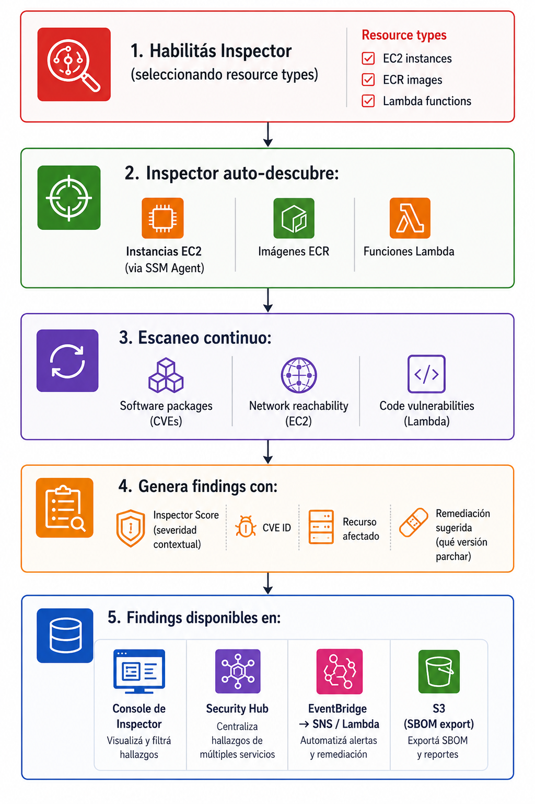
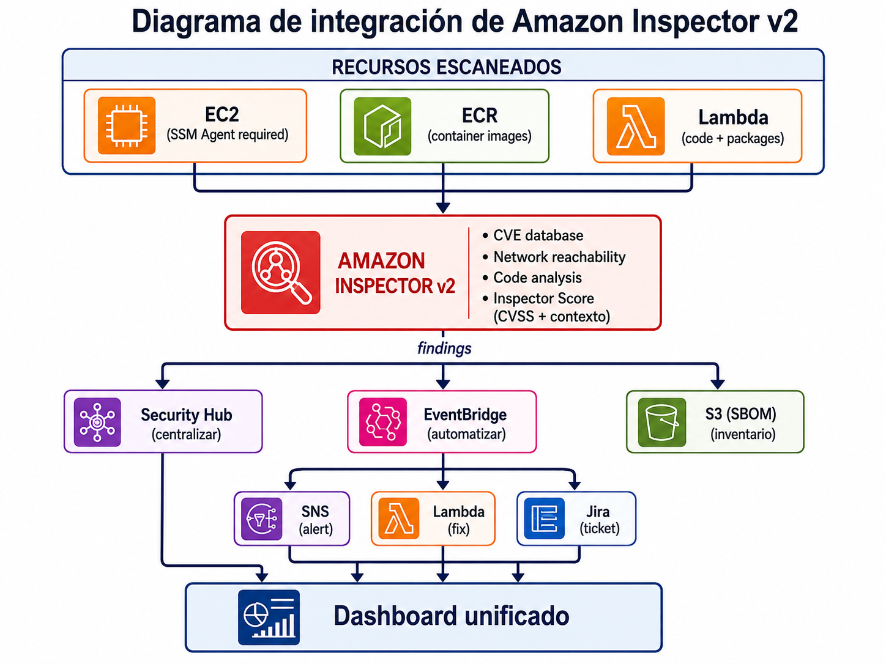

# Escaneo continuo de vulnerabilidades con Amazon Inspector

| Campo | Definición |
|-------|------------|
| **Servicio principal** | Amazon Inspector v2 |
| **Prioridad** | Alta |
| **Objetivo** | Identificar vulnerabilidades de software (CVEs), problemas de configuración y dependencias inseguras en EC2, ECR y Lambda |
| **Riesgo mitigado** | Workloads con vulnerabilidades conocidas sin parchar, explotables por atacantes |

---

## ¿Que es y para que sirve?

Amazon Inspector v2 es un servicio de **escaneo continuo y automatizado** de vulnerabilidades.
A diferencia de herramientas que escanean una vez y listo, Inspector **re-escanea automaticamente** cada vez que:

- Se publica un nuevo CVE
- Se instala un nuevo paquete en una EC2 
- Se pushea una nueva imagen a ECR
- Se actualiza una funcion Lamba

### Analogia

Es como un **sistema de salud preventivo** que revisa a cada empleado (workload) continuamente.
No espera a que alguien se engerme (sea explotado): detecta la enfermedad (vulnerabilidad) antes y te dice cuales son las mas graves para que priorices el tratamiento (parche)

### Inspector v1 vs v2


| Aspecto | Inspector v1 (Classic) | Inspector v2 (Actual) |
|---------|----------------------|----------------------|
| **Activación** | Manual, por assessment | Automático, continuo |
| **Agente** | Inspector Agent propio | SSM Agent (ya instalado) |
| **Cobertura** | Solo EC2 | EC2 + ECR + Lambda + código |
| **Scoring** | Solo CVSS | Inspector Score (CVSS + contexto) |
| **Integración** | Limitada | Security Hub, EventBridge, S3 (SBOM) |

### Inspector Score vs CVSS

Inspector no usa solo el score CVSS estandar. Agrega **contexto**:

- ¿La instancia tiene IP publica? (mas riesgo)
- ¿El puerto vulnerable esta abierto en el Security Group?
- ¿Hay un exploit disponible? (mas urgente)
- ¿Se esta explotando activamente en the wild?

Esto hace que el score de Inspector sea **mas util** que el CVSS solo..

> **En resumen:** Inspector busca lo que esta roto antes de que alguien lo explote

---

### Flujo basico



### Resource types que escanea

| Resource Type | Qué escanea | Requisito |
|---------------|-------------|-----------|
| **EC2** | Paquetes de SO, kernel, software instalado + network reachability | SSM Agent activo y managed |
| **ECR** | Imágenes de containers (OS packages, language packages) | Push a ECR |
| **LAMBDA** | Dependencias de la función (packages) | Función desplegada |
| **LAMBDA_CODE** | Código fuente de la función (inyección, secretos hardcoded) | Función desplegada |

### Buenas practicas

- Habilitar Inspector en **todas las cuentas y regiones relevantes**
- Activar escaneo de **EC2, ECR Y Lamba** como minimo
- Integrar con **Security Hub** para visibilidad centralizada
- Crear alertas para findings **CRITICAL Y HIGH**
- Definir **SLAs de remediacion** por severidad
- Usar **SBOM export** para inventario de software
- Asegurar que las EC2 tengan el **SSM Agent** activo

---

## Relacion con otros Servicios

| Se relaciona con | Tipo | ¿Cómo? |
|---|---|---|
| **SSM (Systems Manager)** | Dependencia directa | Para escanear EC2, Inspector necesita que la instancia tenga SSM Agent activo y sea una "managed instance". Sin SSM, Inspector no puede escanear la EC2 |
| **ECR** | Integración directa | Inspector escanea automáticamente imágenes cuando se pushean a ECR. Los findings aparecen también en la consola de ECR |
| **Lambda** | Integración directa | Inspector escanea dependencias y código de funciones Lambda |
| **Security Hub** | Integración directa | Envía todos los findings a Security Hub para visibilidad centralizada. Security Hub tiene controles que verifican que Inspector esté habilitado |
| **EventBridge** | Automatización | Reglas que reaccionan a findings (ej: CRITICAL → SNS + ticket en Jira) |
| **SNS** | Notificaciones | Destino de alertas para findings de alta severidad |
| **S3** | Export | SBOM (Software Bill of Materials) se exporta a S3 para análisis |
| **Organizations** | Multi-cuenta | Administrador delegado gestiona Inspector en todas las cuentas |
| **CloudTrail** | Auditoría | Registra acciones sobre Inspector (habilitación, cambios de config) |
| **EC2** | Recurso escaneado | Inspector evalúa paquetes de SO y accesibilidad de red de EC2 |
| **VPC / Security Groups** | Contexto | Inspector usa SGs y configuración de red para evaluar network reachability |
| **Patch Manager (SSM)** | Remediación | SSM Patch Manager puede aplicar los parches que Inspector detectó como faltantes |

### Diagrama de integracion



### Nota sobre SSM Agent

> **Importante**: Para que Inspector pueda escanear instancias EC2, necesita que tengan:

> 1. **SSM Agent instalado** (viene preinstalado en Amazon Linux 2/2023, ubuntu 20.4+, Windows server)
> 2. **IAM Role con policy** `AmazonSSMManagedInstanceCore`
> 3. **Conectividad** al endopoint de SSM (VPC endpoint o internet)
>
> Si una EC2 no es "managed" por SSM, Inspector no lo puede escanear, vas a terminar viendo una cobertura incompleta en el dashboard

---

## Consola

> Ver capturas en [`consola/screenshots.md`](./consola/screenshots.md)

**Habilitar Inspector:**

1. AWS Console -> buscar **Inspector**
2. Click **Get started** -> **Enable Inspector**
3. Seleccionar account type (standalone o delegated admin)
4. Se habilita automaticamente el escaneo de EC2, ECR Y Lamba

**Dashboard principal:**

- **Summary**: Total findings por severidad + recursos escaneados
- **Findings**: Lista filtrable por severidad, tipo de recurso, CVE ID
- **Coverage**: Que % de tus recursos estan siendo escaneados escaneados vs total

**Filtros utiles en findings:**

- Severity: `CRITICAL` primero
- Finding type: `Package vulnerability` o `Network reachability`
- Resource type: `EC2` / `ECR` / `Lamba`
- Status: `ACTIVE` 

---

##  CLI + Terraform

> Ver archivos completos en [`cli-terraform/`](./cli-terraform/)

### CLI - Habilitar Inspector

```bash
aws inspector2 enable \
  --resource-types EC2 ECR LAMBDA LAMBDA_CODE
```

### CLI - Ver estado de habilitación

```bash
aws inspector2 batch-get-account-status \
  --query 'accounts[].{Account:accountId,Status:state.status,EC2:resourceState.ec2.status,ECR:resourceState.ecr.status,Lambda:resourceState.lambda.status}'
```

### CLI - Listar findings CRITICAL activos

```bash
aws inspector2 list-findings \
  --filter-criteria '{
    "findingStatus": [{"comparison": "EQUALS", "value": "ACTIVE"}],
    "severity": [{"comparison": "EQUALS", "value": "CRITICAL"}]
  }' \
  --max-results 10 \
  --query 'findings[].{Title:title,Severity:severity,Resource:resources[0].id,Score:inspectorScore}'
```

### CLI - Listar findings HIGH activos

```bash
aws inspector2 list-findings \
  --filter-criteria '{
    "findingStatus": [{"comparison": "EQUALS", "value": "ACTIVE"}],
    "severity": [{"comparison": "EQUALS", "value": "HIGH"}]
  }' \
  --max-results 10
```

### CLI - Ver cobertura de escaneo

```bash
aws inspector2 list-coverage \
  --query 'coveredResources[].{Resource:resourceId,Type:resourceType,Status:scanStatus.statusCode}' \
  --output table
```

### CLI - Conteo de findings por severidad

```bash
aws inspector2 list-finding-aggregations \
  --aggregation-type SEVERITY \
  --query 'responses[].{Severity:severityCount}'
```

### CLI - Exportar SBOM a S3

```bash
# aws inspector2 create-sbom-export \
#   --report-format SPDX_2_3 \
#   --s3-destination '{
#     "bucketName": "mi-bucket-sbom",
#     "keyPrefix": "inspector-sbom/",
#     "kmsKeyArn": "arn:aws:kms:us-east-1:123456789012:key/my-key"
#   }'
```

### CLI - Deshabilitar Inspector (si necesario)

```bash
# aws inspector2 disable \
#   --resource-types EC2 ECR LAMBDA LAMBDA_CODE
```

### Terraform

```hcl
# Habilitar Inspector v2
resource "aws_inspector2_enabler" "main" {
  account_ids    = [data.aws_caller_identity.current.account_id]
  resource_types = ["EC2", "ECR", "LAMBDA", "LAMBDA_CODE"]
}

# EventBridge: alertar findings CRITICAL
resource "aws_cloudwatch_event_rule" "inspector_critical" {
  name        = "InspectorCriticalFindings"
  description = "Alerta cuando Inspector encuentra vulnerabilidades CRITICAL"

  event_pattern = jsonencode({
    source      = ["aws.inspector2"]
    detail-type = ["Inspector2 Finding"]
    detail = {
      severity = ["CRITICAL"]
    }
  })
}

resource "aws_cloudwatch_event_target" "inspector_to_sns" {
  rule      = aws_cloudwatch_event_rule.inspector_critical.name
  target_id = "SendToSNS"
  arn       = var.sns_topic_arn
}
```

---