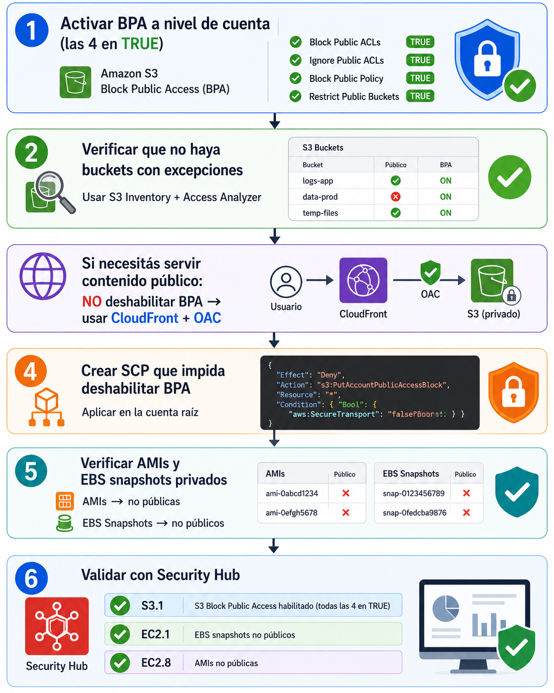

# Bloquear acceso publico a S3/AMI/EBS


| Campo | Definición |
|-------|------------|
| **Servicio principal** | Amazon S3 Block Public Access / EC2 AMI / EBS |
| **Prioridad** | Alta |
| **Objetivo** | Evitar la exposición accidental de buckets S3, snapshots EBS y AMIs |
| **Riesgo mitigado** | Data breach por buckets públicos, filtración de datos de clientes, multas regulatorias |

---

## ¿Que es y para que sirve?

S3 Block Public Access (BPA) es un conjunto de **4 configuraciones** que actuan como un "candado master" para evitar que cualquier bucket o objeto de S3 sea accesible publicamente, sin importar las ACLs o bucket policies individuales

### Analogia

Es como un interruptor maestro de seguridad en un edificio: aunque alguien deje una puerta individual sin llave, el sistema central impide que se abra desde afuera

### Las 4 configuraciones

| Setting | Qué hace |
|---------|----------|
| **BlockPublicAcls** | Bloquea la creación de nuevas ACLs públicas |
| **IgnorePublicAcls** | Ignora ACLs públicas existentes |
| **BlockPublicPolicy** | Bloquea bucket policies que otorgan acceso público |
| **RestrictPublicBuckets** | Restringe acceso público a buckets con policies públicas |

### Jerarquía de aplicación

```text
Organización (SCP que previene deshabilitar BPA)
    │
    ▼
Cuenta (S3 Account-level BPA → las 4 en TRUE)
    │
    ▼
Bucket individual (BPA por bucket → hereda la más restrictiva)
```

> **La mas restrictiva gana** Si la cuenta bloquea, no importa si el bucket permite

### Tambien proteger

- **AMIs**: marcar como privadas (no compartir publicamente)
- **EBS Snapshots**: no compartir publicamente
- Desde Security Hub: controles EC2.1 (snapshots) y EC2.8 (AMI publica)

> **En resumen:** Activa BPA a nivel de cuenta con las 4 configuraciones en TRUE
> Desde abril 2023 los buckets nuevos ya vienen con BPA activado por defecto

## ¿Como funciona?

### Flujo de proteccion



### Buenas practicas

- Habilitar BPA a nivel cuenta con las 4 opciones en TRUE
- Crear SCP organizacional que impida deshabilitar BPA
- Para contenido publico, usar CloudFront + OAC (Origin Acces Control) + WAF
- Proteger tambien AMIs y EBS snapshots
- Monitorear con Security Hub + Access Analyzer


## Relacion con otros servicios

| Servicio | Relación |
|---|---|
| **S3** | BPA se aplica directamente sobre el servicio S3 a nivel cuenta y bucket |
| **Organizations / SCPs** | SCP para impedir `s3:PutBucketPublicAccessBlock` con valores FALSE |
| **CloudFront** | Alternativa para servir contenido público sin deshabilitar BPA (OAC + WAF) |
| **Security Hub** | Control S3.1 verifica BPA habilitado; EC2.1/EC2.8 verifican snapshots/AMIs |
| **IAM Access Analyzer** | Detecta buckets con policies que permiten acceso externo |
| **Macie** | Complemento: descubre datos sensibles en buckets S3 |
| **CloudTrail** | Registra cambios en la configuración de BPA |

---

## Consola

> Ver capturas en [`consola/screenshots/`](./consola/screenshots.md)

### BPA a nivel cuenta

1. AWS console -> **S3** -> **Block Public Acces settings for this account**
2. Click **Edit** -> marcar las 4 casillas -> **Save**

### BPA a nivel bucket

1. S3 -> seleccionar bucket -> **Permissions** -> **Block public access**
2. Verificar que las 4 esten en ON

### AMIs y Snapshots

1. EC2 -> **AMIs** -> verificar que no sean publicas
2. EC2 -> **Snapshots** -> verificar sharing que no sea publico

---

## CLI + Terraform

### CLI - Activar BPA a nivel cuenta

```bash
aws s3control put-public-access-block \
  --account-id $(aws sts get-caller-identity --query Account --output text) \
  --public-access-block-configuration \
    BlockPublicAcls=true,IgnorePublicAcls=true,BlockPublicPolicy=true,RestrictPublicBuckets=true
```

### CLI - Verificar BPA a nivel cuenta

```bash
aws s3control get-public-access-block \
  --account-id $(aws sts get-caller-identity --query Account --output text)
```

### CLI - Activar BPA en un bucket específico

```bash
aws s3api put-public-access-block \
  --bucket mi-bucket \
  --public-access-block-configuration \
    BlockPublicAcls=true,IgnorePublicAcls=true,BlockPublicPolicy=true,RestrictPublicBuckets=true
```

### CLI - Verificar BPA en un bucket

```bash
aws s3api get-public-access-block --bucket mi-bucket
```

### CLI - Verificar snapshots públicos

```bash
aws ec2 describe-snapshots \
  --owner-ids self \
  --query 'Snapshots[?contains(to_string(CreateVolumePermissions), `all`)].{Id:SnapshotId,Size:VolumeSize}' \
  --output table
```

### Terraform

```hcl
# BPA a nivel cuenta (las 4 en TRUE)
resource "aws_s3_account_public_access_block" "account" {
  block_public_acls       = true
  ignore_public_acls      = true
  block_public_policy     = true
  restrict_public_buckets = true
}
```

---

