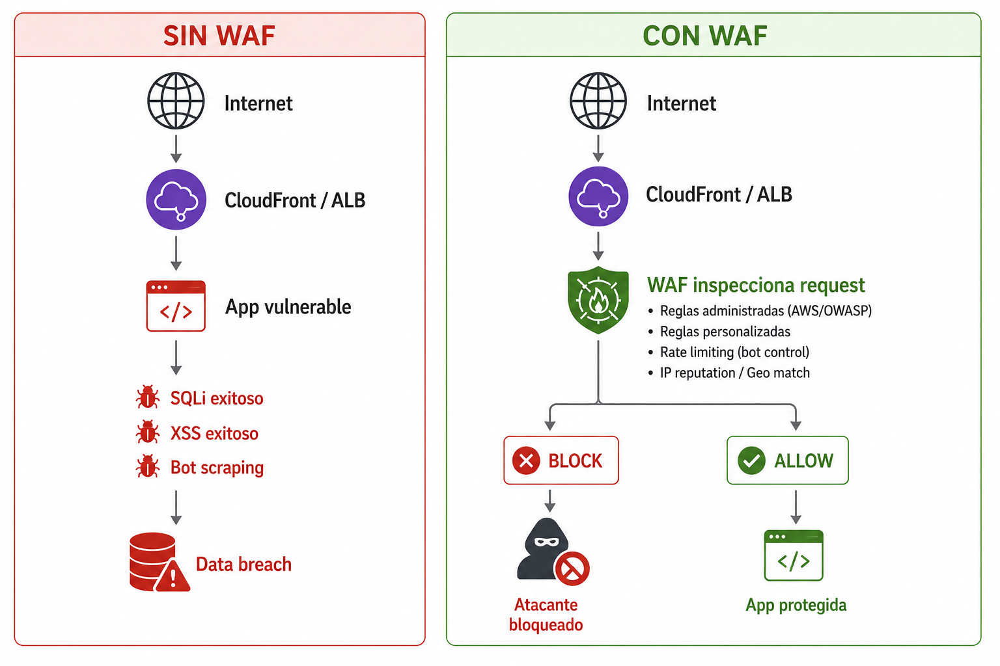

# Seguridad de las Aplicaciones

## Descripcion

Las aplicaciones web son la **superficie de ataque mas expuesta** de una organizacion en la nube. AWS WAF (Web Application Firewal) inspecciona cada request HTTP / HTTPS antes de que llegue a tu aplicacion, bloqueando SQL, XSS, Bots maliciosos, fuerza bruta y patrones del OWASP Top 10

Se trabaja **1 QuickWin**:

| # | QuickWin | Servicio principal | Prioridad |
|---|----------|-------------------|-----------|
| 15 | [WAF con reglas gestionadas](./waf-reglas-gestionadas.md) | AWS WAF v2 / Firewall Manager | Alta |

## ¿Por que es critico?



## Recursos que puede proteger WAF 

| Servicio | Scope WAF | Uso típico |
|----------|-----------|------------|
| **CloudFront** | CLOUDFRONT (global) | Apps con CDN, distribución global |
| **Application Load Balancer (ALB)** | REGIONAL | Apps web tradicionales sobre EC2/ECS |
| **API Gateway (REST)** | REGIONAL | APIs REST públicas |
| **AppSync (GraphQL API)** | REGIONAL | APIs GraphQL |
| **Cognito User Pool** | REGIONAL | Endpoints de autenticación |
| **App Runner** | REGIONAL | Aplicaciones containerizadas managed |
| **Verified Access** | REGIONAL | Acceso Zero Trust a apps internas |
| **Amplify** | CLOUDFRONT | Apps frontend |

> **Importante**: WAF protege la **capa HTTP**, pero **no es un reemplazo** 

## Estructura

```text
08-seguridad-aplicaciones/
├── README.md                       ← estás acá
├── waf-reglas-gestionadas.md       ← Quick Win 15 completo
├── consola/
│   └── screenshots.md
└── cli-terraform/
    ├── commands.sh
    └── main.tf
```
