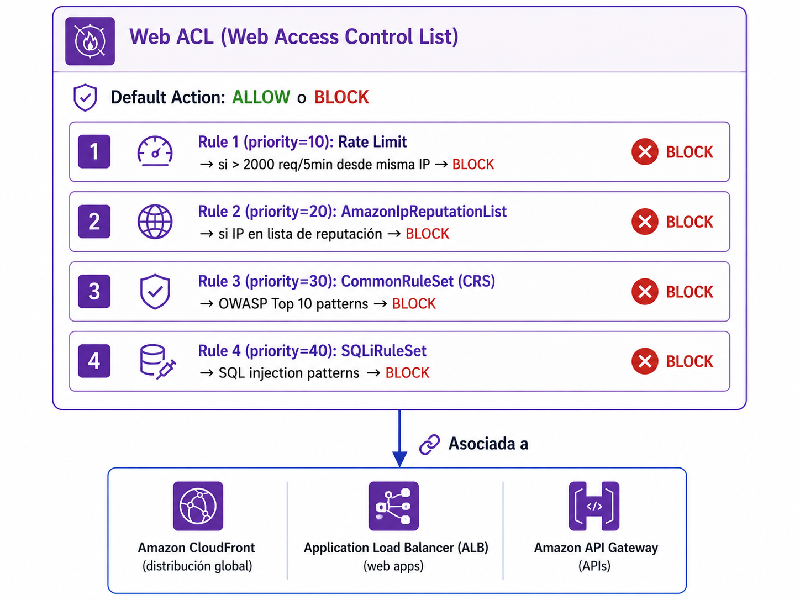
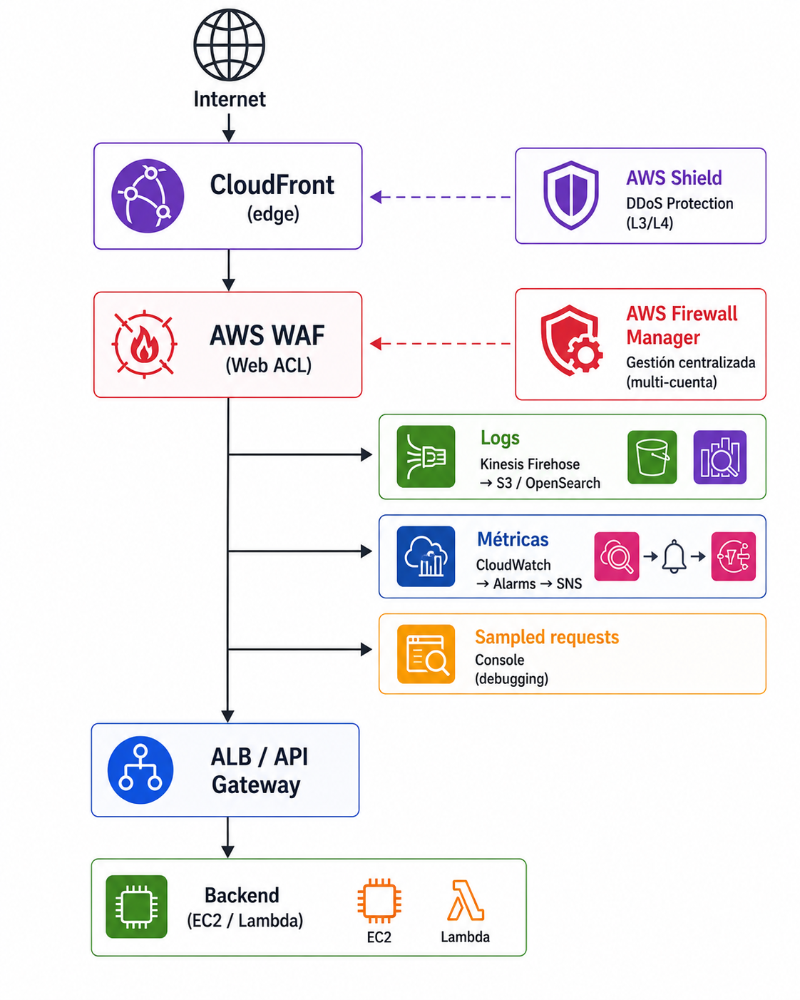

# Proteger aplicaciones web con AWS WAF

| Campo | Definición |
|-------|------------|
| **Servicio principal** | AWS WAF v2 / CloudFront / ALB / API Gateway / Firewall Manager |
| **Prioridad** | Alta |
| **Objetivo** | Reducir ataques web comunes, tráfico malicioso y abuso de endpoints públicos |
| **Riesgo mitigado** | Explotación de vulnerabilidades web, SQLi, XSS, bots, IPs maliciosas y OWASP Top 10 |

---

## ¿Que es y para que sirve?


AWS WAF es un **Web Application Firewall** que inspecciona cada solicitud HTTP/HTTPS
que llega a tu aplicación. Aplica reglas que pueden **permitir, bloquear, contar o
desafiar (CAPTCHA)** la solicitud según patrones de ataque conocidos.

### Analogia

Es como el **control de seguridad de un aeropuerto**: revisa cada pasajero (request) antes de dejarlo subir al avion (tu app). y comportamientos sospechosos (bots, rate limiting). Pero no puede leer la mente del pasajero ni saber si lleva intenciones maliciosas dentro de los limites de lo "normal"

### Lo que WAF SÍ hace

- ✅ Bloquea **inyecciones conocidas** (SQLi, XSS, LFI, RFI)
- ✅ Bloquea **IPs maliciosas** (listas de reputación)
- ✅ Detecta **bots automatizados** (Bot Control)
- ✅ Aplica **rate limiting** contra abuso
- ✅ **Geo-blocking** por país
- ✅ Genera **logs y métricas** para análisis

### Lo que WAF NO hace (limitaciones importantes)

- ❌ No **enforce autorización** (IDOR, broken access control)
- ❌ No conoce **lógica de negocio**
- ❌ No protege contra **vulnerabilidades en dependencias** (supply chain)
- ❌ No decide sobre **TLS/cifrado**
- ❌ No reemplaza **diseño seguro** ni revisiones de código

> **En resumen:** WAF es una capa esencial de defensa en profundidad, no una bala de plata.

---

## ¿Como funciona?

### Componentes principales




### Flujo de evaluación

```text
1. Llega una request HTTP/HTTPS
         │
         ▼
2. WAF evalúa reglas por prioridad (menor → mayor)
         │
         ▼
3. ¿Match con alguna regla terminating (BLOCK/ALLOW)?
    │                          │
   SÍ                         NO
    │                          │
    ▼                          ▼
  Aplica acción          Aplica default action
  de la regla            (ALLOW o BLOCK)
```

### Acciones disponibles por regla

| Acción | Qué hace |
|--------|----------|
| **ALLOW** | Permite la request, no se evalúan más reglas |
| **BLOCK** | Bloquea con HTTP 403 |
| **COUNT** | Solo cuenta y loguea (útil para testing antes de pasar a BLOCK) |
| **CAPTCHA** | Muestra un challenge tipo CAPTCHA |
| **CHALLENGE** | Challenge silencioso (cliente debe resolver JS) |

### Mapeo OWASP Top 10 (2025) -> AWS Managed Rule Groups

Esta tabla es **clave** para entender que cubre WAF y que NO cubre:

| OWASP Top 10 (2025) | Managed Rule Groups recomendados | Qué hace WAF |
|---------------------|----------------------------------|--------------|
| **A01 - Broken Access Control** | CommonRuleSet, AdminProtectionRuleSet, AmazonIpReputationList, BotControl | Reduce scanning y abuso automatizado. **NO** enforce autorización ni previene IDOR |
| **A02 - Security Misconfiguration** | CommonRuleSet, KnownBadInputsRuleSet, AmazonIpReputationList | Bloquea payloads de explotación. **NO** corrige defaults inseguros, ni headers faltantes |
| **A03 - Software Supply Chain Failures** | - | **Fuera del scope**. Es runtime/dependencias |
| **A04 - Cryptographic Failures** | - | **Fuera del scope**. TLS se decide antes del WAF |
| **A05 - Injection (SQLi, XSS, etc.)** | CommonRuleSet, SQLiRuleSet, KnownBadInputsRuleSet | ✅ Punto fuerte de WAF: bloquea patrones conocidos |
| **A06 - Insecure Design** | - | **Fuera del scope**. Es problema de diseño |
| **A07 - Auth Failures** | BotControl, AccountTakeoverPrevention, rate limiting | Mitiga credential stuffing y fuerza bruta |
| **A08 - Data Integrity Failures** | KnownBadInputsRuleSet | Bloquea payloads pero no firma de código |
| **A09 - Logging/Monitoring Failures** | - | WAF aporta logs, pero el monitoreo es externo |
| **A10 - SSRF** | CommonRuleSet (EC2MetaDataSSRF rules) | Bloquea intentos de extraer metadata EC2 |

### Baseline recomendado de Managed Rule Groups

| Rule Group | Qué protege |
|------------|-------------|
| **AWSManagedRulesCommonRuleSet (CRS)** | OWASP Top 10 general, restricciones de tamaño, SSRF a metadata EC2 |
| **AWSManagedRulesKnownBadInputsRuleSet** | Payloads de exploits conocidos, log4j, etc. |
| **AWSManagedRulesSQLiRuleSet** | SQL Injection |
| **AWSManagedRulesAmazonIpReputationList** | IPs en listas negras de AWS (botnets, scanners, anonimizadores) |
| **AWSManagedRulesAdminProtectionRuleSet** | Protección de paneles admin expuestos |
| **AWSManagedRulesLinuxRuleSet** | LFI específico de Linux (si tu backend es Linux) |
| **AWSManagedRulesUnixRuleSet** | Inyección de comandos Unix |


### Buenas Practicas

- Asociar Web ACLs a **CloudFront, ALB o API Gateway**
- Activar **reglas gestionadas por AWS** (baseline)
- Comenzar reglas en **COUNT** para validar falsos positivos
- Pasar a **BLOCK** las reglas validadas
- Habilitar **WAF logging** a CloudWatch / S3 / Kinesis FireHose
- Usar **Firewall Manager** en entornos multi-cuenta
- Combinar con **Shield Advanced** para proteccon DDoS 

## Relacion con otros servicios

| Se relaciona con | Tipo | ¿Cómo? |
|---|---|---|
| **CloudFront** | Asociación directa | WAF se asocia con scope CLOUDFRONT (global, edge). Ideal para apps con CDN |
| **ALB** | Asociación directa | WAF se asocia con scope REGIONAL. Protege apps tradicionales |
| **API Gateway** | Asociación directa | Protege APIs REST/HTTP. Scope REGIONAL |
| **AppSync** | Asociación directa | Protege APIs GraphQL |
| **Cognito User Pool** | Asociación directa | Protege endpoints de auth |
| **App Runner / Amplify / Verified Access** | Asociación directa | Apps managed |
| **Shield Advanced** | Complementario | Shield protege L3/L4 (DDoS); WAF protege L7 (app) |
| **Firewall Manager** | Multi-cuenta | Gestión centralizada de políticas WAF en toda la organización |
| **CloudWatch** | Métricas | WAF emite métricas (BlockedRequests, AllowedRequests, CountedRequests) |
| **CloudWatch Logs / S3 / Kinesis Firehose** | Logging | Destinos para logs de WAF |
| **Security Hub** | Findings | Recibe findings relacionados con WAF |
| **Lambda@Edge** | Complementario | Procesamiento previo en CloudFront edge |
| **GuardDuty** | Indirecto | Detecta comunicación con IPs maliciosas detectadas por WAF |

### Diagrama de integracion





---

## 🖥️ 4. Consola

> Ver capturas en [`consola/screenshots.md`](./consola/screenshots.md)

### Crear Web ACL (Protection Pack wizard)

1. AWS Console → **WAF & Shield** → **Web ACLs** → **Create web ACL**
2. **Describe application**: elegir categoría (API, Web, Both)
3. **Choose protection level**:
   - **Recommended** → reglas recomendadas por AWS
   - **Essentials** → set mínimo viable
   - **You build it** → control total
4. Asociar a recursos (CloudFront, ALB, API Gateway, etc.)
5. Configurar logging

### Tunear reglas (COUNT → BLOCK)

1. Web ACL → **Rules** → seleccionar managed rule group
2. **Edit** → cambiar acción a **Count** inicialmente
3. Revisar **sampled requests** y **CloudWatch metrics**
4. Cuando esté validado → cambiar a **Block**

### Ver tráfico bloqueado

1. Web ACL → **Sampled requests**
2. Filtrar por acción: Blocked
3. Inspeccionar request: User-Agent, URI, IP de origen

---

## ⌨️ 5. CLI + Terraform

### CLI - Listar Web ACLs

```bash
# Regional (ALB, API Gateway, etc.)
aws wafv2 list-web-acls --scope REGIONAL

# CloudFront (siempre desde us-east-1)
aws wafv2 list-web-acls --scope CLOUDFRONT --region us-east-1
```

### CLI - Listar managed rule groups disponibles

```bash
aws wafv2 list-available-managed-rule-groups \
  --scope REGIONAL \
  --query 'ManagedRuleGroups[?VendorName==`AWS`].{Name:Name,Description:Description}' \
  --output table
```

### CLI - Ver detalles de una Web ACL

```bash
aws wafv2 get-web-acl \
  --name production-web-acl \
  --scope REGIONAL \
  --id "id-aqui"
```

### CLI - Asociar Web ACL a un ALB

```bash
aws wafv2 associate-web-acl \
  --web-acl-arn "arn:aws:wafv2:us-east-1:123456789012:regional/webacl/production-web-acl/abc" \
  --resource-arn "arn:aws:elasticloadbalancing:us-east-1:123456789012:loadbalancer/app/my-alb/xxx"
```

### CLI - Ver sampled requests (debugging)

```bash
aws wafv2 get-sampled-requests \
  --web-acl-arn "arn:aws:wafv2:us-east-1:123456789012:regional/webacl/production-web-acl/abc" \
  --rule-metric-name "aws-managed-common" \
  --scope REGIONAL \
  --time-window StartTime=2026-06-17T00:00:00Z,EndTime=2026-06-17T01:00:00Z \
  --max-items 50
```

### Terraform - Web ACL completa con baseline OWASP

```hcl
resource "aws_wafv2_web_acl" "main" {
  name        = "production-web-acl"
  description = "WAF baseline OWASP Top 10"
  scope       = "REGIONAL"  # o "CLOUDFRONT"

  default_action {
    allow {}
  }

  # Rate limit: 2000 req/5min por IP
  rule {
    name     = "rate-limit"
    priority = 10

    action {
      block {}
    }

    statement {
      rate_based_statement {
        limit              = 2000
        aggregate_key_type = "IP"
      }
    }

    visibility_config {
      cloudwatch_metrics_enabled = true
      metric_name                = "rate-limit"
      sampled_requests_enabled   = true
    }
  }

  # AWS IP Reputation List
  rule {
    name     = "aws-ip-reputation"
    priority = 20

    override_action {
      none {}
    }

    statement {
      managed_rule_group_statement {
        name        = "AWSManagedRulesAmazonIpReputationList"
        vendor_name = "AWS"
      }
    }

    visibility_config {
      cloudwatch_metrics_enabled = true
      metric_name                = "aws-ip-reputation"
      sampled_requests_enabled   = true
    }
  }

  # Common Rule Set (OWASP Top 10)
  rule {
    name     = "aws-common-rule-set"
    priority = 30

    override_action {
      none {}  # usa las acciones del rule group
    }

    statement {
      managed_rule_group_statement {
        name        = "AWSManagedRulesCommonRuleSet"
        vendor_name = "AWS"
      }
    }

    visibility_config {
      cloudwatch_metrics_enabled = true
      metric_name                = "aws-common-rule-set"
      sampled_requests_enabled   = true
    }
  }

  # SQL Injection
  rule {
    name     = "aws-sqli"
    priority = 40

    override_action {
      none {}
    }

    statement {
      managed_rule_group_statement {
        name        = "AWSManagedRulesSQLiRuleSet"
        vendor_name = "AWS"
      }
    }

    visibility_config {
      cloudwatch_metrics_enabled = true
      metric_name                = "aws-sqli"
      sampled_requests_enabled   = true
    }
  }

  # Known Bad Inputs
  rule {
    name     = "aws-known-bad-inputs"
    priority = 50

    override_action {
      none {}
    }

    statement {
      managed_rule_group_statement {
        name        = "AWSManagedRulesKnownBadInputsRuleSet"
        vendor_name = "AWS"
      }
    }

    visibility_config {
      cloudwatch_metrics_enabled = true
      metric_name                = "aws-known-bad-inputs"
      sampled_requests_enabled   = true
    }
  }

  visibility_config {
    cloudwatch_metrics_enabled = true
    metric_name                = "production-web-acl"
    sampled_requests_enabled   = true
  }
}
```

### Terraform - Asociar a ALB

```hcl
resource "aws_wafv2_web_acl_association" "alb" {
  resource_arn = aws_lb.main.arn
  web_acl_arn  = aws_wafv2_web_acl.main.arn
}
```

>  **Nota**: si vas a gestionar reglas como recursos separados (`aws_wafv2_web_acl_rule`),
> agregá `lifecycle { ignore_changes = [rule] }` al `aws_wafv2_web_acl` para evitar conflictos.

---

## Notas personales

> - Recordar: WAF protege L7 (HTTP), no es para DDoS L3/L4 (eso es Shield)
> - Siempre validar managed rules en COUNT antes de pasar a BLOCK
> - Los costos de Bot Control, Fraud Control y DDoS Protection son adicionales

---