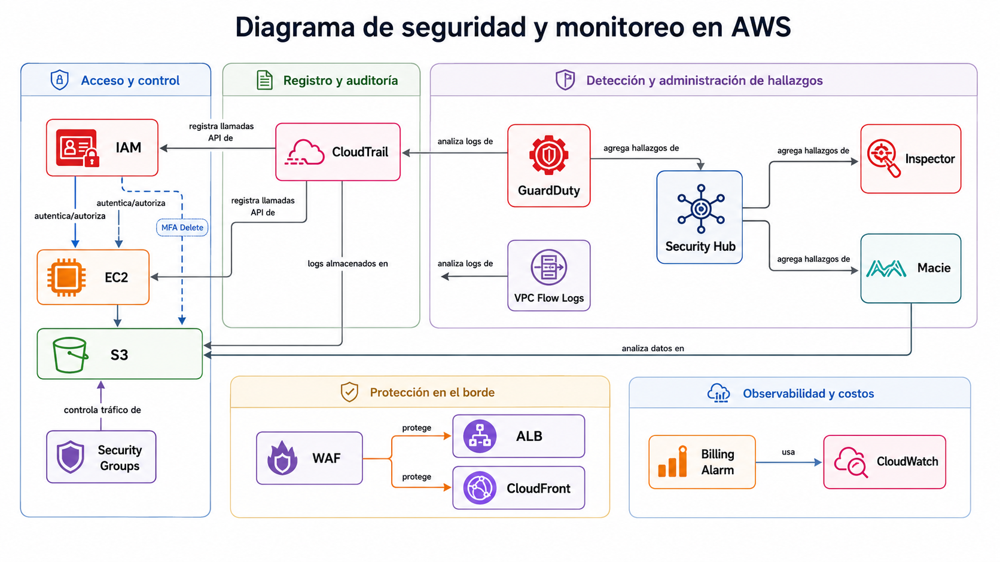

# AWS Security QuickWins

Repositorio Central sobre buenas practicas de Seguridad en AWS  [Modelo de Madurez en Seguridad de AWS](https://maturitymodel.security.aws.dev/es/1.-quickwins/).  
El objetivo es recorrer cada QuickWin, entenderlo, documentarlo y llevarlo a la práctica con consola, CLI y Terraform.

---

## 📋 Metodología

Cada QuickWin se trabaja siguiendo estos 5 pasos:

| Paso | Descripción |
|------|-------------|
| 1️⃣ | **Leer** la documentación oficial del QuickWin |
| 2️⃣ | **Resumir** con mis palabras para validar que entendí el servicio y cómo funciona |
| 3️⃣ | **Analizar relaciones** con otros servicios (ej: cómo se relaciona IAM con EC2) |
| 4️⃣ | **Visualizar** el servicio en la consola de AWS (screenshots) |
| 5️⃣ | **Implementar** por CLI y llevar la configuración a Terraform |

---

## Contenido

| # | Dominio | QuickWins | 
|---|---------|-----------|
| 01 | [Gobierno de la seguridad](./01-gobierno-seguridad/) | Contactos de seguridad · Selección de regiones | 
| 02 | [Aseguramiento de la seguridad](./02-aseguramiento-seguridad/) | Evaluar postura de seguridad (CSPM / Security Hub) |  
| 03 | [Gestión de identidades y accesos](./03-identidades-accesos/) | MFA · Protección Root · Federación · Limpieza de accesos | 
| 04 | [Detección de amenazas](./04-deteccion-amenazas/) | GuardDuty · CloudTrail · Alarma de Billing | 
| 05 | [Gestión de vulnerabilidades](./05-gestion-vulnerabilidades/) | Inspector | 
| 06 | [Protección de la infraestructura](./06-proteccion-infraestructura/) | Limpieza de Security Groups / puertos riesgosos | 
| 07 | [Protección de datos](./07-proteccion-datos/) | S3 Block Public Access · Macie | 
| 08 | [Seguridad de las aplicaciones](./08-seguridad-aplicaciones/) | WAF con reglas gestionadas | 
| 09 | [Respuesta a incidentes](./09-respuesta-incidentes/) | Actuar ante hallazgos críticos | 

---

## 🗂️ Estructura del repositorio

```
aws-security-quickwins/
├── README.md
│
├── 01-gobierno-seguridad/
│   ├── README.md
│   ├── contactos-seguridad.md
│   ├── seleccion-regiones.md
│   ├── consola/
│   │   └── screenshots.md
│   └── cli-terraform/
│       ├── commands.sh
│       └── main.tf
│
├── 02-aseguramiento-seguridad/
│   ├── README.md
│   ├── cspm-security-hub.md
│   ├── consola/
│   └── cli-terraform/
│
├── 03-identidades-accesos/
│   ├── README.md
│   ├── mfa.md
│   ├── proteccion-root.md
│   ├── federacion-identidades.md
│   ├── limpieza-accesos.md
│   ├── consola/
│   └── cli-terraform/
│
├── 04-deteccion-amenazas/
│   ├── README.md
│   ├── guardduty.md
│   ├── cloudtrail.md
│   ├── alarma-billing.md
│   ├── consola/
│   └── cli-terraform/
│
├── 05-gestion-vulnerabilidades/
│   ├── README.md
│   ├── inspector.md
│   ├── consola/
│   └── cli-terraform/
│
├── 06-proteccion-infraestructura/
│   ├── README.md
│   ├── security-groups-limpieza.md
│   ├── consola/
│   └── cli-terraform/
│
├── 07-proteccion-datos/
│   ├── README.md
│   ├── s3-bpa.md
│   ├── macie.md
│   ├── consola/
│   └── cli-terraform/
│
├── 08-seguridad-aplicaciones/
│   ├── README.md
│   ├── waf-reglas-gestionadas.md
│   ├── consola/
│   └── cli-terraform/
│
├── 09-respuesta-incidentes/
│   ├── README.md
│   ├── hallazgos-criticos.md
│   ├── consola/
│   └── cli-terraform/
│
├── 10-resiliencia/
│   ├── README.md
│   ├── resilience-hub.md
│   ├── consola/
│   └── cli-terraform/
│
└── diagramas/
    ├── mapa-relaciones-servicios.md
    └── img/
```

---

## 🗺️ Mapa de relaciones entre servicios

Visión global de cómo se conectan los servicios de seguridad entre sí:




> 📌 Este diagrama se irá ampliando a medida que avancemos con cada dominio.

---

## 🧰 Herramientas utilizadas

| Herramienta | Uso |
|-------------|-----|
| **AWS Console** | Visualización y exploración de servicios |
| **AWS CLI** | Interacción por línea de comandos |
| **Terraform** | Infraestructura como código (IaC) |
| **Git/GitHub** | Versionado y documentación del aprendizaje |

---

## 📝 Template por QuickWin

Cada archivo `.md` de un QuickWin sigue esta estructura:

```markdown
# [Nombre del QuickWin]

## 📖 1. ¿Qué es y para qué sirve?
> Resumen con mis palabras.

## 🔧 2. ¿Cómo funciona?
- Servicio(s) AWS involucrado(s)
- Flujo básico (3-4 pasos)
- A qué aplica

## 🔗 3. Relación con otros servicios
| Se relaciona con | Tipo de relación | Ejemplo |
|---|---|---|
| ... | ... | ... |

## 🖥️ 4. Consola
> Screenshots y observaciones en `consola/`

## ⌨️ 5. CLI + Terraform
> Comandos y código en `cli-terraform/`

## 📌 Notas personales
> Dudas, lo que me costó, links útiles.
```

---

## 🚀 Orden de estudio recomendado

1. **03 - Identidades y accesos** → IAM es la base de todo en AWS
2. **01 - Gobierno de la seguridad** → Configuraciones base de la cuenta
3. **04 - Detección de amenazas** → CloudTrail + GuardDuty
4. **06 - Protección de la infraestructura** → Security Groups
5. **07 - Protección de datos** → S3 BPA + Macie
6. **02 - Aseguramiento** → Security Hub (agrega todo lo anterior)
7. **05, 08, 09, 10** → Resto de dominios

---

## 📖 Referencia

- [Modelo de Madurez en Seguridad de AWS - QuickWins](https://maturitymodel.security.aws.dev/es/1.-quickwins/)
- [AWS CLI Documentation](https://docs.aws.amazon.com/cli/)
- [Terraform AWS Provider](https://registry.terraform.io/providers/hashicorp/aws/latest/docs)